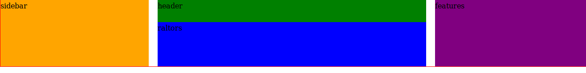
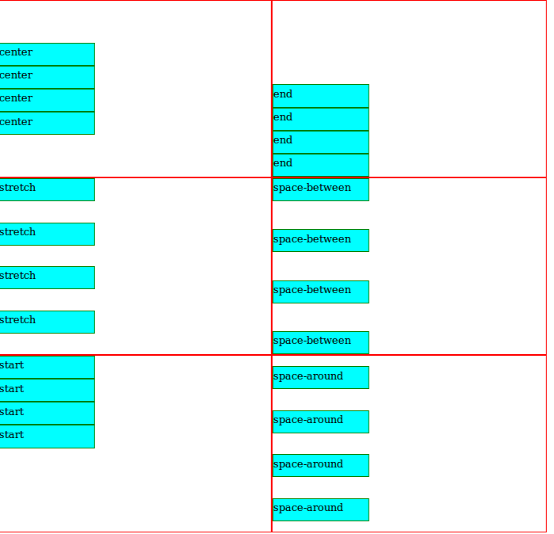

# CSS

# POSITIONING
The position CSS property sets how an element is positioned in a document.
## Positioning values
1. relative
2. sticky
3. fixed
4. absolute
5. static (default)

 
 ## position: relative;
 The element is positioned according to the normal flow of the document.
 * it introduces the ability to use z-index on that element, which doesn't really work with statically  
* The top and bottom properties specify the vertical offset from its normal position; the left and right properties specify the horizontal offset.

read more here https://css-tricks.com/absolute-relative-fixed-positioining-how-do-they-differ/

 ```html
  <p>Hello, mr positioner</p>
  <div class="div1">div 1</div>
  <div class="div2">div 2</div>
 ```
 ```css
  p {
      background: olivedrab;
      margin: 0;
    }
    .div1 {
      height: 50px;
      width: 50px;
      background: coral;
      position: relative;
      top: 150px
    }
    .div2 {
      height: 50px;
      width: 50px;
      background: peru;
    }
 ```
But when 

```css
   position: relative; /*is commented out*/ 

 p {
      background: olivedrab;
      margin: 0;
    }
    .div1 {
      height: 50px;
      width: 50px;
      background: coral;
      /* position: relative; */
      top: 150px  /*this wil not take effect */
    }
    .div2 {
      height: 50px;
      width: 50px;
      background: peru;
    }
```
The result will be

 ### *From my own understanding, relative positioning allows the the page elements to stay in its normal position regarding the existence of the element's(with positin relative) defaut position, and also allows the element in qestion to to be repsoitioned from its default position using the top, left, right and bottom properties which will  not affect the the other elements*
 
 ## position: static;
 An element with *position: static;* is not positioned in any special way; it is always positioned according to the normal flow of the page:
 ###  **Note:**
   Static positioned elements are not affected by the top, bottom, left, and right properties.

## position: fixed
An element with position: fixed; is positioned relative to the viewport.
<li>Note:</li> 

* The element is removed from the normal document flow,
* It always stays in the same place even if the page is scrolled 
* It can be repositioned with the top, bottom, right or left props
* no space is created for the element in the page layout

### Effect of top, bottom, left and right on it
Top, right, left and bottom affects the element in regards to its viewport.

let’s say an element has a top value of 20px, it will be positioned 20px from the top of the viewport
```css
    <p>Hello, Mr positioner</p>
    <p>Hi, Mrs positioner</p>
    <div class="div1">div 1</div>
    <div class="div2">div 2</div>
```
```css
  body {
      padding: 0;
      margin: 0;
    }
    p {
      background: olivedrab;
      height: 50px;
      margin: 0;
    }
    div {
      height: 50px;
      width: 50px;
      background: peru;
    }
    p:nth-child(2) {
      background: blue;
    }
    .div1 {
      background: hotpink;
      position: fixed;
      top: 20px
    }

```
## position: absolute
  * The element is removed from the normal document flow,
  *  no space is created for the element in the page layout.
  * Well, it is positioned based on its closest ancestor with a position other than static.
  * If there is not an ancestor that fits the criteria, it is positioned relative to the body element.

**Note:** body can be scrolled unlike viewport
### Effect of top, bottom, left and right on it

You use the positioning attributes top, left, bottom. and right to set the location.

* Remember that these values will be relative to the **next parent element with relative (or absolute) positioning**. If there is no such parent, it will default all the way back up to the <html> element itself meaning it will be placed relatively to the page itself.

Quick, let’s look at the code
```css
body {
margin: 0;
height: 1000px;
background-color: azure;
}

section {
border: 1px solid rgb(225, 255, 0);
margin: 100px auto;
width: 500px;
padding: 10px;
background-color: crimson;
}

h1 {
height: 50px;
width: 50px;
margin: 2px;
background: green;
font-size: 40px;
color: antiquewhite;
}
```

The Html code
```html
<section>
  <h1>1</h1>
  <h1>2</h1>
  <h1>3</h1>
</section>

<section class="section2">
  <div>
    <h1>4</h1>
    <h1 class="div5">5</h1>
    <h1>6</h1>
  </div>
</section>
```

When div5 is given position absolute
```css
,div5 {
background-color: tan;
position: absolute;
top: 20px;
left: 1px;
}
```

Since there is no immediate parent with position: absolute or relative, The absolute position of div5 will be relative to the <html> tag

But when an immediate parent is assigned position: absolute or relative
```css
div {
position: relative;
background-color: yellowgreen;
}
```
The position: absolute for div5 will be in relation to the immediate parent which is the div

Also if the parent with the position: absolute or relative is the section2, and NOT the immediate div, div5’s position absolute will be in relation to section2 and not the div.
```css
div {
/* position: relative; */
background-color: yellowgreen;
}

section:nth-child(2) {
 position: relative;
 }

```

## Position: sticky

#  GRID

1. grid
2. grid-area
3. grid-auto-columns
4. grid-auto-flow
5. grid-auto-rows
6. grid-column
7. grid-column-end
8. grid-column-gap
9. grid-column-start
10. grid-gap
11. grid-row
12. grid-row-end
13. grid-row-gap
14. grid-row-start
15. grid-template
16. grid-template-areas
17. grid-template-columns
18. grid-template-rows

## Display: grid
grid layout enables an author to align elements into columns and rows.

This makes the children of a contaning element take up the full width and height of the container equally
1. if the cotainer  has a width of 
```css
   width: 300px;
   height: 500px
```
while the children, a width of 
```css
   width: 100px; (in  total) and 
   height: 400px
```
the chlden will share the remaining 200px in width and 100px in height among them selves equally

## Display: inline-grid
This is similar to grid. The difference is
1. its inline. It takes the width of the content. Extra width is letf for other elements to.
eg. if width of the content is 200px, the container will justcover it up leaving other space around it for other elements

- The vertical line of grid items are called columns.
- The horizontal line of grid items are called rows.
- The space between each column/row are called gaps.

## grid-template-columns
 defines the **number of columns** in your grid layout, and it can define the **width of each column**.

 -  value is a space-separated-list, where each value defines the length of the respective column.

 -  But you can choose to explicitly name the lines. Note the bracket syntax for the line names: 

 - If your definition contains repeating parts, you can use the ```css repeat() ``` notation to streamline things:
 ```css
 .container {
  display: grid;
  border: 1px solid red;
  grid-template-columns: repeat(3, 100px)  /* This will create a 5 colums of size 100px */; /* This is equivalent to */grid-template-columns: 100px 100px 100px ;

  grid-template-columns: 50px repeat(5, 100px);  /* This will create a 6 colums with the first 50px and the remainng ones 100px */ /* This is equivalent to */ grid-template-columns: 50px 100px  100px 100px 100px 100px;
}
 ```

 **Note, the names couod be anything and can have more than one name.**
 ```css
 .container {
  grid-template-columns: [first] 40px [line2] 50px [line3] auto [col4-start] 50px [five] 40px [end];
}

.container {
  grid-template-columns: [row1-start] 25% [row1-end row2-start] 25% [row2-end];
}
 ```

 - The ```css fr``` unit allows you to set the size of a track as a fraction of the free space of the grid container. For example, this will set each item to one third the width of the grid container:
 ```css

.container {
  display: grid;
  border: 1px solid red;
  grid-template-columns: 1fr 5fr 1fr; /* Th *is will create  3columns, where the first and last are the width and the second, times arger*/
}

 ```
 ## The grid-template-rows Property
 The grid-template-rows property specifies the number (and the heights) of the rows in a grid layout.
 - The value is a space-separated-list, where each value defines the the height of the respective row:
 - The number of rows is determined by the number of values defined in the space-separated list.
 ```html
 <body>
  
  <div class="container"> 

    <div class="sidebar">
      sidebar
    </div>

    <header class="header">
      header
    </header>

    <div class="realtors">
      raltors
    </div>

    <section class="features">
      features
    </section>

    <div class="story_picture">
      story
    </div>

    <div class="story_content">
      story
    </div>

    <div class="homes">
      homes
    </div>

    <div class="galary">
      galary
    </div>

    <footer class="footer">
      footer
    </footer>
  </div>
</body>
 ```

 ```css
 .container {
  display: grid;
  grid-template-rows: 100px 40px 10px
}

 ```
 Only the first three rows will be asigned heights, 100, 40 and 10px.

 ## grid-template-areas
 Defines a grid template by referencing the names of the grid areas which are specified with the grid-area property
 - Repeating the name of a grid area causes the content to span those cells
 -  A period signifies an empty cell. 
 - Each row in your declaration needs to have the same number of cells.
 * Adjacent period can mean a single dot. As long as the periods  do not have spaces between them.
 - The grid-gap property defines the grid’s gutters and is shorthand for grid-column-gap and grid-row-gap.
 - This is the fun part. grid-template-areas defines the areas available in the grid. The name given to grid areas are arbitrary but should be sensible. The grid-template-areas also provides a crude visual representation of the page layout.

**Discoveries/Rules:**
* You cannot seperate a single grid-area with a dot 
```css
grid-template-areas: 
    "side . side " /* This will not work */
    "head head head "
    "realtor realtor realtor";
```
* You cannot seperate a single grid-area with an area 
```css
grid-template-areas: 
    "side side side "
    "head realtor head  "/* This will not work */
    "head realtor head  ";/* This will not work */
```
* An area cannot go but horizontal and vertical at a time 
```css
 grid-template-areas: 
    "side side side " /* is will not work */
    "side realtor head  "
    "side realtor head  ";
```
* Ensure the content of a container are all asign a grid area if the container is been given a gr-d-teamplate-area
This is cool
```css
<div class="container"> 

    <div class="sidebar">
      sidebar
    </div>

    <header class="header">
      header
    </header>

    <div class="realtors">
      raltors
    </div>
</div>

    <section class="features">
      features 
    </section>
```
But this will be messy
```css
<div class="container"> 

    <div class="sidebar">
      sidebar
    </div>

    <header class="header">
      header
    </header>

    <div class="realtors">
      raltors
    </div>

    <section class="features">
      features /* Because of this */ 
    </section>
</div>

```

```css
.sidebar {
  background-color: orange;
   grid-area: side;
}

.header {
  background-color: green;
  grid-area: head;
}

.realtors {
  background-color: blue;
   grid-area: realtor;
}
.features {
  background-color: purple;
   grid-area: fea ;
}

.container {
  display: grid;
  border: 1px solid red;
  grid-template-columns: repeat(3, auto) ;
  grid-template-rows: repeat(3, 50px);

  grid-template-areas: 
    "side .... .... realtor"
    "side head head  realtor"
    "side . . .";
}
```

## grid-template
A shorthand for setting **grid-template-rows**, **grid-template-columns**, and **grid-template-areas** in a single declaration.
```css
.container {
  grid-template: none | grid-template-rows grid-template-columns>;
}
```
For example 
```css
.container2 {
  display: grid;
  border: 1px solid rgb(0, 255, 17);

grid-template: 
  ' side head head head' 50px /*grid-template-rows: repeat(3, 50px);*/
  "side realtor realtor fea" 50px
  "side realtor realtor fea" 50px
  / auto auto auto auto   /*grid-template-columns: repeat(4, auto) */
}
```
is the same as

```css
.container2 {
  display: grid;
  border: 1px solid red;
  grid-template-columns: repeat(4, auto) ;
  grid-template-rows: repeat(3, 50px);

  grid-template-areas: 
    "side head head  head"
    "side realtor realtor   fea"
    "side realtor realtor  fea   ";
}
```

## grid-column-gap
You could say its just like giving some space inbetween a collection of books aligned horizontally

```css
grid-column-gap: <size of the line>
```
This can alsobe writtn as in higher browsers like Chrome 68+, Safari 11.2 Release 50+ and Opera 54+
```css
column-gap: <size of the line>
```
```html
  <div class="container"> 
    <div class="sidebar">
      sidebar
    </div>
    <header class="header">
      header
    </header>
    <div class="realtors">
      raltors
    </div>
    <section class="features">
      features
    </section>
  </div>
```

```css
.sidebar {
  background-color: orange;
  grid-area: side;
}
.header {
  background-color: green;
  grid-area: head;
}
.realtors {
  background-color: blue;
  grid-area: realtor;
}
.features {
  background-color: purple;
  grid-area: fea ;
}
.container {
  display: grid;
  border: 1px solid red;
  grid-template-columns: repeat(4, auto) ;
  grid-template-rows: repeat(3, 50px);
  grid-template-areas: 
    "side head head  fea"
    "side realtor realtor   fea"
    "side realtor realtor  fea   ";
  grid-column-gap: 20px
}

```

```

## grid-row-gap
You could say its just like giving some space inbetween a collection of books aligned vertically

```css
grid-row-gap: <size of the line>
```
This can also be writtn as in higher browsers like Chrome 68+, Safari 11.2 Release 50+ and Opera 54+
```css
row-gap: <size of the line>
```
```html
  <div class="container"> 
    <div class="sidebar">
      sidebar
    </div>
    <header class="header">
      header
    </header>
    <div class="realtors">
      raltors
    </div>
    <section class="features">
      features
    </section>
  </div>
```

```css
.sidebar {
  background-color: orange;
  grid-area: side;
}
.header {
  background-color: green;
  grid-area: head;
}
.realtors {
  background-color: blue;
  grid-area: realtor;
}
.features {
  background-color: purple;
  grid-area: fea ;
}
.container {
  display: grid;
  border: 1px solid red;
  grid-template-columns: repeat(4, auto) ;
  grid-template-rows: repeat(3, 50px);
  grid-template-areas: 
    "side head head  fea"
    "side realtor realtor   fea"
    "side realtor realtor  fea   ";
  grid-row-gap: 20px
}

```


## grid-gap
A shorthand for grid-row-gap and grid-column-gap
```html
  <div class="container"> 
    <div class="sidebar">
      sidebar
    </div>
    <header class="header">
      header
    </header>
    <div class="realtors">
      raltors
    </div>
    <section class="features">
      features
    </section>
  </div>
```

```css
.sidebar {
  background-color: orange;
  grid-area: side;
}
.header {
  background-color: green;
  grid-area: head;
}
.realtors {
  background-color: blue;
  grid-area: realtor;
}
.features {
  background-color: purple;
  grid-area: fea ;
}
.container {
  display: grid;
  border: 1px solid red;
  grid-template-columns: repeat(4, auto) ;
  grid-template-rows: repeat(3, 50px);
  grid-template-areas: 
    "side head head  fea"
    "side realtor realtor   fea"
    "side realtor realtor  fea   ";
  grid-gap: 50px 10px;
}
```


Note
* If no grid-row-gap is specified, it's set to the same value as grid-column-gap
```css
container {
  display: grid;
  border: 1px solid red;
  grid-template-columns: repeat(4, auto) ;
  grid-template-rows: repeat(3, 50px);
  grid-template-areas: 
    "side head head  fea"
    "side realtor realtor   fea"
    "side realtor realtor  fea   ";
  grid-gap: 10px 10px;
}
```


## justify-items
When a cntainer is disolayed grid, the contrents span down the vertical direction of the container. For instance

```css
div {
  height: 100px;
  width: 150px
}
.sidebar {
  background-color: orange;
}
.header {
  background-color: green;
}
.realtors {
  background-color: blue;
}
.features {
  background-color: purple;
}
.container {
  display: grid;
  border: 3px solid red;
  height: 95vh;
  width: 1000px;
}
```
```html
  <div class="container"> 
    <div class="sidebar">
      sidebar
    </div>
    <div class="header">
      header
    </div>
    <div class="realtors">
      raltors
    </div>
    <div class="features">
      features
    </div>
  </div>
```


But with justity-item, the contents a aligned at the center in a horizontal or inline format
  
```css
.container {
  display: grid;
  border: 3px solid red;
  height: 95vh;
  width: 1000px;
  justify-items: center
}
```


The values include

```css
.container {
  justify-items: start | end | center | stretch;
}
```

## Align-content

This is similar tojustify-item. But the difference is that in this case,it is in the vertical,cloumn or block direction

```css
.container {
  align-items: start | end | center | stretch | space-around | space-between;
}
```
```html
 <div class="background"> 
  
  <div class="container1 container">
    <div class="align_item">center</div>
    <div class="align_item">center</div>
    <div class="align_item">center</div>
    <div class="align_item">center</div>
  </div>

  <div class="container2 container">
    <div class="align_item">end</div>
    <div class="align_item">end</div>
    <div class="align_item">end</div>
    <div class="align_item">end</div>
  </div>

  <div class="container3 container">
    <div class="align_item">stretch</div>
    <div class="align_item">stretch</div>
    <div class="align_item">stretch</div>
    <div class="align_item">stretch</div>
  </div>

  <div class="container4 container">
    <div class="align_item">space-between  </div>
    <div class="align_item">space-between</div>
    <div class="align_item">space-between</div>
    <div class="align_item">space-between</div>
  </div>

  <div class="container5 container">
    <div class="align_item">start</div>
    <div class="align_item">start</div>
    <div class="align_item">start</div>
    <div class="align_item">start</div>
  </div>

  <div class="container6 container">
    <div class="align_item">space-around</div>
    <div class="align_item">space-around</div>
    <div class="align_item">space-around</div>
    <div class="align_item">space-around</div>
  </div>

  </div>
```

```css
.container1 {
  grid-area: section1;
  align-content: center
}
.container2 {
  grid-area: section2;
  align-content: end; 
}
.container3 {
  grid-area: section3;
  align-content: stretch
}
.container4 {
  grid-area: section4;
  align-content: space-between;
}
.container5 {
  grid-area: section5;
  align-content: start;
}
.container6 {
  grid-area: section6;
  align-content:  space-around;
}
```


<div style='background-color: coral; color :black; display: grid; justify-items: center'>
  <h1>FORMULAR</h1>
  justify-content(flex) <--------> justify-items(grid)

  align-content(flex) <--------> align-item(grid)
</div>


# Tips

<a herf="https://css-tricks.com/guide-svg-animations-smil/" style='text-ecoration: underline'> SVG animation </a>

<a href='https://hashnode.com/post/master-npm-in-under-10-minutes-or-get-your-money-back-cjqmak392001i7vs2ufdlvcqb'>Master npm in Under 10 Minutes or Get Your Money Back</a>

