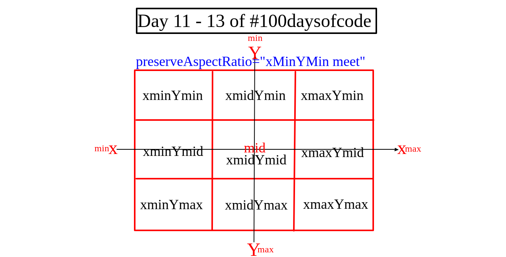

# **SVG Scalable Vector Graphics**

# **The Anatomy of an SVG**


* ## The Viewport
The viewport is the visible area of an SVG image. An SVG image can logically be as wide and high as you want, but only a certain part of the image can be visible at a time. The area that is visible is called the viewport. 
 It creates a “port” through which you can “view” a section of an SVG.
>>  **The SVG viewport is like a porthole window whose size determines what you can see through it but it doesn’t define the size of whatever might be visible through that viewport. What’s on the other side could theoretically be any size at all.**

The viewport is set by adding `width` and `height` to the svg tag.
#### For example
```html
<svg width="150px" height="150px">
  <rect x='0' y='0' width='200px' height='100px' fill="red"></rect>
  <circle cx='50px' cy='120px' r='50px'></circle>
</svg>
```
```css
svg {
    background: yellow;
  }
 ```

 

 From the image above, the the viewport is set to 150 by 150px.Therefore that will be the viscible part of the svg. What ever is contained inside remains the same but only the part that is contained within the 150 by 150 becomes viscible.
#### Example 2
```html
  <style>
      svg { background: green }
      rect { fill: blue   }
      circle {   fill: red }
      polygon {  fill: yellow  }
    </style>
  </head>

  <body>
    <svg x="0px" y="0px" width="250px" height="100px" viewBox="50 -10 100 50">
      <rect x="10" y="5" fill="white" stroke="black" width="90" height="90" />
      <circle fill="white" stroke="black" cx="170" cy="50" r="45" />
      <polygon fill="white" stroke="black" points="279,5 294,35 328,40 303,62
309,94 279,79 248,94 254,62 230,39 263,35" />
      <line fill="none" stroke="yellow" x1="410" y1="95" x2="440" y2="6" />
      <line fill="none" stroke="yellow" x1="360" y1="6" x2="360" y2="95" />
    </svg>

    <svg x="0px" y="0px" width="250px" height="100px" viewBox="0 0 500 200">
      <rect x="10" y="5" fill="white" stroke="black" width="90" height="90" />
      <circle fill="white" stroke="black" cx="170" cy="50" r="45" />
      <polygon fill="white" stroke="black" points="279,5 294,35 328,40 303,62
309,94 279,79 248,94 254,62 230,39 263,35" />
      <line fill="none" stroke="yellow" x1="410" y1="95" x2="440" y2="6" />
      <line fill="none" stroke="yellow" x1="360" y1="6" x2="360" y2="95" />
    </svg>
    <p>Paragraph</p>
```


* ## The ViewBox
Its is represented by a `viewbox` attribute with four numbers separated with a space and/or comma.
```html
 <svg width="150px" height="150px" viewbox='0 0 0 0'>
 </svg>
 ```
 `viewBox = <min-x> <min-y> <width> <height>`

The viewBox attribute defines the position and dimension, in user space, of an SVG viewport.
Taking it one after another, let me talk about what I mean by ... 
1. **Position**:       
This is determined from the first two numbers. It is sometimes seen as panning. From the code snippet above, the `viewbox` is et to `0 0 0 0`. The first two numbers which is `0 0` determines the position. Lets look at these examples


 While the height and width are maintained at 300 by 300, x and y are varied. Hope it is quite clear.

2. **Dimension**:   

This is determined by the last two numbers, ie the `width` and `height` parameters. If for instance, with `preserveAspectRatio` set to none, 


From the images above, in the second image section 2, the `viewbox='0 0 800 400' ` is while the `viewport` is `width="200px" height="200px"`. 

When, the `width` which is `800` is made equivalent to the `viewport width` which is `200px`. That means it is in the ration of `800 : 200px` == ` 4:1 `. Each inch of the `viewport` is equivalent to `4inch` of the `viewbox`. The same applies to the height dimension.


Think of viewbox as a virtual approach to **crop an image**.


Whenever you use the viewBox attribute, remember to set your viewport dimensions and preserveAspectRatio too. If you don’t,  you’ll likely have an oversized graphic:

>> if the viewport is like a window, the viewBox is like a telescope.


* ## Preserving Aspect Ratio
First of all,  when we talk   about aspect ratio, you  must know that it is the ratio of the width and height of the viewbox and  viewport




This topic is giving me headach, ma continue width  later. Moving on,


