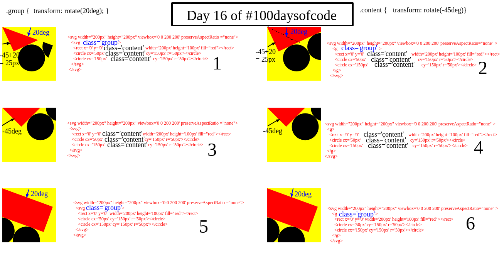
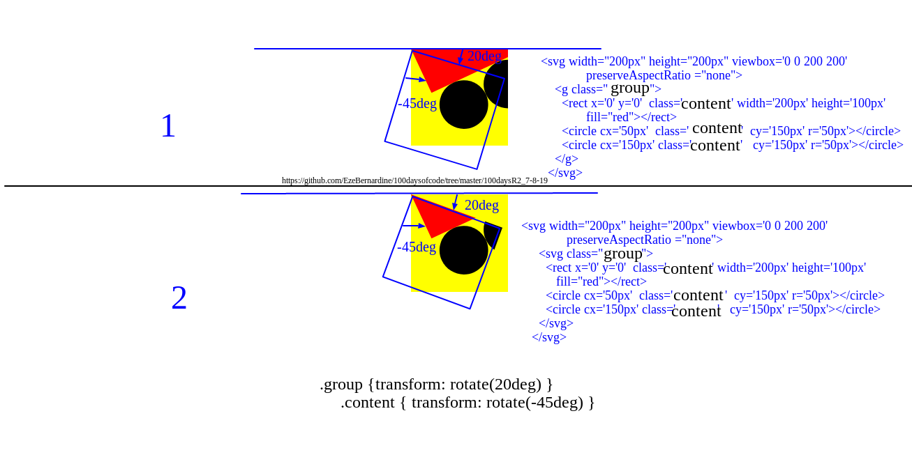

# **SVG g element**

The SVG <g> element is used to group SVG shapes together. Once grouped you can style the whole group of shapes as if it was a single shape.

For example

```html
<svg
  width="200px"
  height="200px"
  viewbox="0 0 200 200"
  preserveAspectRatio="none"
>
  <g>
    <rect x="0" y="0" width="200px" height="100px" fill="red"></rect>
    <circle cx="50px" cy="150px" r="50px"></circle>
    <circle cx="150px" cy="150px" r="50px"></circle>
  </g>
</svg>
```


## The Styling of g Elements

When you style an `svg` element, the styles affects the children as a single element. Let style the example above and see the effect


## Difference between styling a `g` element and a nested `svg` tag.

I have detailly designed an image that goes a long way to explaning the differences (well, i hope it does).



In section 1 from the above image, the contents are in a nested `svg` tags. The `.group {transform: rotate(20deg) }` styles the `svg` tag directly housing the contents; `<rect></rect> <circle></circle> <circle></circle>`, while the cotents are given a style of `.content { transform: rotate(-45deg) }`.

Therefore, while the `svg` directly housing the contents `rotates 20deg`; tilts downwards, the content from that position tilts upwards for `-45deg`.

The major difference between section 1 and 2 is that in section 1, the contents are inclosed in an `svg` tag. This resulted to part of the contents not been visible since any content outside both the inner and outer `svg` tag will not be seen . While in section 2, they are enclosed in a `g` tag, and will be visible.
Lets look at this image for btter clarification



For section 3 to section 6, it is either the contents or the parent container that is atyled.
