# SVG Scalable Vector Graphics

## **The Anatomy of an SVG**


### The Viewport
The viewport is the visible area of the SVG image. An SVG image can logically be as wide and high as you want, but only a certain part of the image can be visible at a time. The area that is visible is called the viewport. 
 It creates a “port” through which you can “view” a section of an SVG.
>>  **The SVG viewport is like a porthole window whose size determines what you can see through it but it doesn’t define the size of whatever might be visible through that viewport. What’s on the other side could theoretically be any size at all.**

The viewport is set by adding `width` and `height` to the svg tag.
#### For example
```html
<svg width="150px" height="150px">
  <rect x='0' y='0' width='200px' height='100px' fill="red"></rect>
  <circle cx='50px' cy='120px' r='50px'></circle>
</svg>
```
```css
svg {
    background: yellow;
  }
 ```

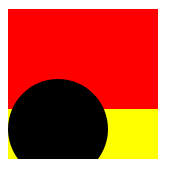

 From the image above, the the viewport is set to 150 by 150px.Therefore that will be the viscible part of the svg. What ever is contained inside remains the same but only the part that is contained within the 150 by 150 becomes viscible.

### The ViewBox
Its is represented by a `viewbox` attribute with four numbers separated with a space and/or comma.
```html
 <svg width="150px" height="150px" viewbox='0 0 0 0'>
 </svg>
 ```
 `viewBox = <min-x> <min-y> <width> <height>`

The viewBox attribute defines the position and dimension, in user space, of an SVG viewport.
Taking it one after another, let me talk about what I mean by ... 
1. **Position**:       
This is determined from the first two numbers. It is sometimes seen as panning. From the code snippet above, the `viewbox` is et to `0 0 0 0`. The first two numbers which is `0 0` determines the position. Lets look at these examples
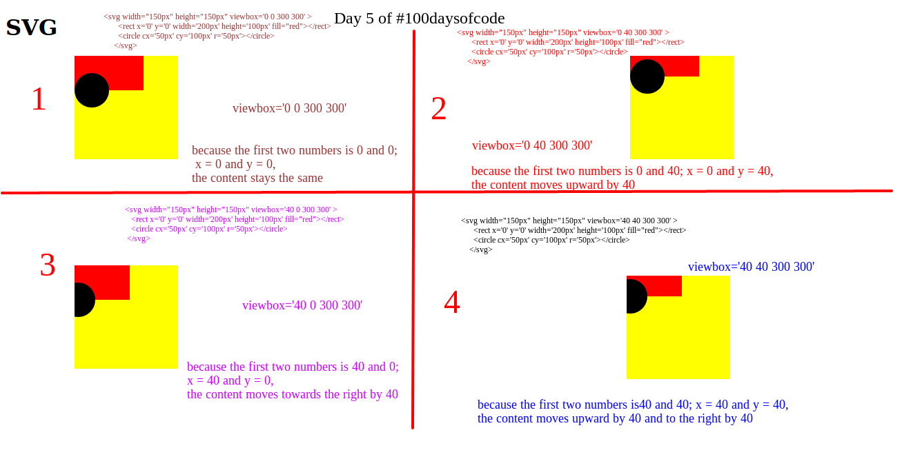
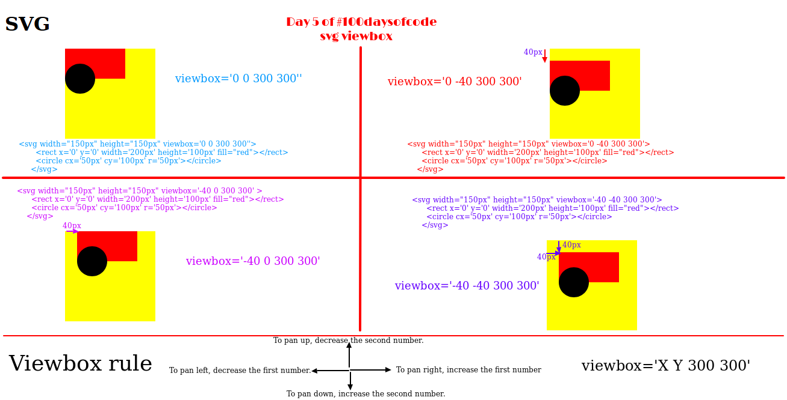
 While the height and width are maintained at 300 by 300, x and y are varied. Hope it is quite clear.

2. **Dimension**:   
This is determined by the last two numbers, ie the `width` and `height` parameters. If for instance we have
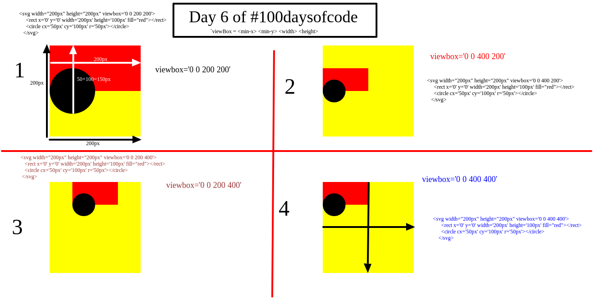

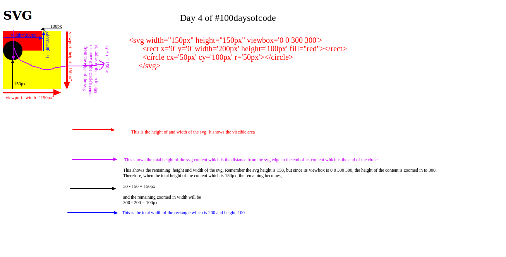

 Think of viewbox as a virtual approach to **crop an image**.

The value of the viewBox attribute is a list of four numbers min-x, min-y, width and height, separated by whitespace and/or a comma, which specify a rectangle in user space which is mapped to the bounds of the viewport established for the associated element.

Whenever you use the viewBox attribute, remember to set your viewport dimensions too. If you don’t, they’ll default to 100% and you’ll likely have an oversized graphic:

>> if the viewport is like a window, the viewBox is like a telescope.

`viewBox="0 0 450 100"`  
`viewBox="minX minY width height"`

* **minx**:  _the beginning x coordinate_
* **miny**: _the beginning y coordinate_
* **width**: _width of the viewbox_
* **height**: _height of the viewbox_

Example
```html
  <style>
      svg { 
        background: green
      }

      rect {
        fill: blue
      }

      circle {
        fill: red
      }

      polygon {
        fill: yellow
      }
    </style>
  </head>

  <body>
    <svg x="0px" y="0px" width="250px" height="100px" viewBox="50 -10 100 50">
      <rect x="10" y="5" fill="white" stroke="black" width="90" height="90" />
      <circle fill="white" stroke="black" cx="170" cy="50" r="45" />
      <polygon fill="white" stroke="black" points="279,5 294,35 328,40 303,62
309,94 279,79 248,94 254,62 230,39 263,35" />
      <line fill="none" stroke="yellow" x1="410" y1="95" x2="440" y2="6" />
      <line fill="none" stroke="yellow" x1="360" y1="6" x2="360" y2="95" />
    </svg>

    <svg x="0px" y="0px" width="250px" height="100px" viewBox="0 0 500 200">
      <rect x="10" y="5" fill="white" stroke="black" width="90" height="90" />
      <circle fill="white" stroke="black" cx="170" cy="50" r="45" />
      <polygon fill="white" stroke="black" points="279,5 294,35 328,40 303,62
309,94 279,79 248,94 254,62 230,39 263,35" />
      <line fill="none" stroke="yellow" x1="410" y1="95" x2="440" y2="6" />
      <line fill="none" stroke="yellow" x1="360" y1="6" x2="360" y2="95" />
    </svg>
    <p>Paragraph</p>
```

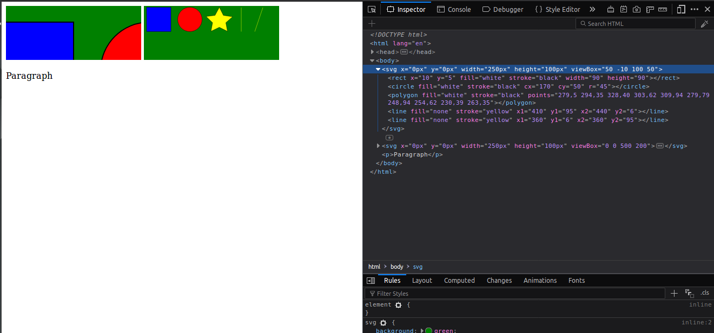


From the first image, it is seen that the content has been zoomed. This is due to the fact that the viewport was reduced `viewBox="50 -10 100 50"` while the second image has viewport `viewBox="0 0 500 200"`.

###  Why Set a Viewbox? 
SVG does much more than just draw a shape. SVG can be used in web design. It can create one figure on top of another for a shadow effect. It can transform a shape so that it tilts in one direction. For the advanced filters, you will need to understand and use the viewbox attribute.

### Preserving Aspect Ratio
It helps you  specify how the SVG viewer (e.g. the browser) is to display the SVG image. 

The preserveAspectRatio attribute takes two values separated by a space. 
* The first value tells how the view box is aligned within the viewport.
* The second value tells how the aspect ratio is to be preserved (if at all). 
[tutorials.jenkov.com](http://tutorials.jenkov.com/svg/svg-viewport-view-box.html)


1. The first value specifying the alignment consists of two parts. The first part specifies the x-alignment and the second part specifies the y-alignment. Here is a list of the values for x- and y-alignment:   

Value |	Description
------|----------
xMin |	Align minimum x of view box with the left edge of the viewport.
xMid |	Align midpoint on the x-axis of view box with the center of the viewport on the x-axis.
xMax |	Align maximum x of view box with the right edge of the viewport.
YMin |	Align minimum y of view box with the top edge of the viewport.
YMid |	Align midpoint on the y-axis of view box with the center point of the viewport on the y-axis.
YMax |	Align maximum y of view box with the bottom edge of the viewport.

2.  The second part of the preserveAspectRatio attribute value can take three different values:

Value |	Description
------|----------
meet |	Preserves aspect ratio and scales view box to fit within viewport.
slice |	Preserves aspect ratio and slices off any part of the image that does not fit inside the viewport.
none |	Does not preserve aspect ratio. Scales image to fit view box fully into viewport. Proportions will be distorted.

 The second part of the preserveAspectRatio attribute value is appended to the first part, separated by a space. Here are two examples:
```html
preserveAspectRatio="xMidYMid meet"

preserveAspectRatio="xMinYMin slice"
```
#### The work of viewbox
* It defines the aspect ratio of the image.
* It defines how all the lengths and coordinates used inside the SVG should be scaled to fit the total space available.
* It defines the origin of the SVG coordinate system, the point where x=0 and y=0.


### Coordinate System Units
If you do not specify any units inside the width and height attributes, the units are assumed to be pixels. That is, a width 500 means 500 pixels.

If you prefer to use different units than pixels, you can. Here is a list of the units you can use with the `<svg>` element: 

Unit| Description
---- | -------
em |	The default font size - usually the height of a character.
ex |	The height of the character x
px |	Pixels
pt |	Points (1 / 72 of an inch)
pc |	Picas (1 / 6 of an inch)
cm |	Centimeters
mm |	Millimeters
in |	Inches

>**The units you set on the `<svg>` element only affects the size of the `<svg>` element (the viewport). The size of the SVG shapes displayed in the SVG image are determined by the units you set on each shape. If no units are specified, the units will default to pixels.**

## **Drawing Shapes**

### Rectangles
This is done with the `rect` keyword. There are really only 6 basic attributes that control the position and shape of the rectangle on screen here

```html
 <rect x='40' y='20'  width='150'  height='50px' ></rect>
 ```
 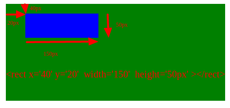

Dimensions | Meaning
------| ---------------
x  |    The x position of the top left corner of the rectangle.
y  |    The y position of the top left corner of the rectangle.
width|  The width of the rectangle
height | The height of the rectangle
rx  |   The x radius of the corners of the rectangle
ry |    The y radius of the corners of the rectangle 

### Circle
This tag is used to create a circle, and it has only three attributes.
```html
<circle cx="25" cy="75" r="20"/>
```
attribute | meaning
--------|---------------
r  |  The radius of the circle.
cx |  The x position of the center of the circle.
cy |  The y position of the center of the circle.

**For exmple**
```html
<circle r='60' cy='110px' cx='100px'></circle>
```

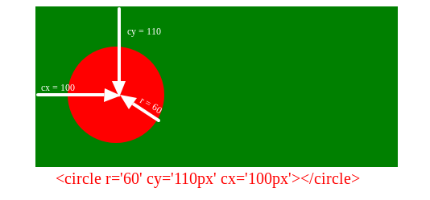

## Ellipse
This more of the general form of a circle. Here you can size or determine the x-radius and the y-radius callled the semi major and minor axis.
```html
<ellipse cx="75" cy="75" rx="20" ry="5"/>
``` 

attribute | meaning
--------|---------------
rx  |   The x radius of the ellipse.
ry  |   The y radius of the ellipse.
cx  |   The x position of the center of the ellipse.
cy  |   The y position of the center of the ellipse. 

## Line
As the name applies, it is used to draw lines.
```html
 <line x1="10" x2="50" y1="110" y2="10" stroke='pink'/>
```
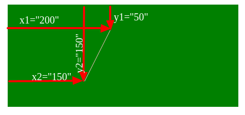

attribute | meaning
--------|---------------
x1 |   The x position of point 1.
y1 |    The y position of point 1.
x2 |    The x position of point 2.
y2 |   The y position of point 2. 

## Polyline
This is used to create a group of connected lines. It has on attribute; the `path` which is a list of all the points seperated with a coma

attribute | meaning
--------|---------------
path | Its a list of points, seperated by a comma. Each point must contain two numbers, an x coordinate and a y coordinate. So the list (0,0), (1,1) and (2,2) could be written: "0 0, 1 1, 2 2".

```html
  <stye>
      polygon {
        fill: black
      }
  </stye>
 <polyline points="60 150, 150 150, 200 50, 130 30, 50 50"/>
 ```
 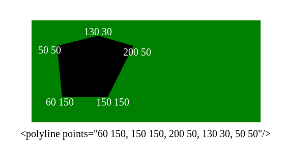

 ## Polygon
 Polygons are a lot like polylines in that they're composed of straight line segments connecting a list of points.
 ```html
  <polygon points="50 60, 100 100, 50 140, 50 60, 150 140, 150 60, 100 100"/>
  ```
attribute | meaning
--------|---------------
  path | It is a list of points sepereated with commas. Each point must contain two numbers, an x coordinate and a y coordinate. So the list (0,0), (1,1) and (2,2) could be written: "0 0, 1 1, 2 2". The drawing then closes the path, so a final straight line would be drawn from (2,2) to (0,0).
 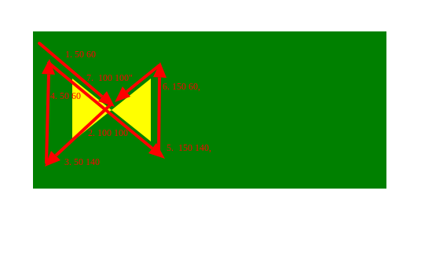

The path automatically returns to the first point for you at the end, creating a closed shape. 

For example
```html
 <polygon points="50 60, 100 100, 50 140, 50 60, 150 140, 150 60"/>
 ```
 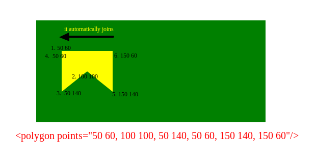

 ## Path
It is used to create lines, curves, arcs and more. Path SVG can be executed by using the path tag.The `<path> `element in SVG is the ultimate drawing element. It can draw anything! The path element takes a single attribute to describe what it draws: the ` ` attribute.
M x,y |	Move to the absolute coordinates x,y

no | attribute | meaning
-|--------|---------------
 straight lines.||
| _________|________________ |________________________________________________________________________
1. | M (x,y) |	Move to the absolute coordinates x,y
2. |m (x,y) |	Move to the right x and down y (or left and up if negative values) (The "Move To" command appears at the beginning of paths to specify where the drawing should start)
| _________|________________ |________________________________________________________________________
32. |L (x,y) |	Draw a straight line to the absolute coordinates x,y
4. |l (x,y ) |	Draw a straight line to a point that is relatively right x and down y (or left and up if negative values)
| _________|________________ |________________________________________________________________________
5. |H (x) |	Draw a line horizontally to the exact coordinate x
6. |h (x) |	Draw a line horizontally relatively to the right x (or to the left if a negative value)
| _________|________________ |________________________________________________________________________
7. |V( y) |	Draw a line vertically to the exact coordinate y
8. |v( y) |	Draw a line vertically relatively down y (or up if a negative value)
 | | |
9. |Z (or z) |	Draw a straight line back to the start of the path
curve lines||
| _________|________________ |________________________________________________________________________
10. |C  ( cX1,cY1 cX2,cY2 eX,eY) |	Draw a bezier curve based on two bezier control points and end at specified coordinates
11. |c | 	Same with all relative values
| _________|________________ |________________________________________________________________________
12. | S (cX2,cY2 eX,eY) |	Basically a C command that assumes the first bezier control point is a reflection of the last bezier point used in the previous S or C command
13. |s |	Same with all relative values
| _________|________________ |________________________________________________________________________
14. |Q (cX,cY eX,eY) |	Draw a bezier curve based a single bezier control point and end at specified coordinates
15. |q |	Same with all relative values
| _________|________________ |________________________________________________________________________
16. |T (eX,eY) |	Basically a Q command that assumes the first bezier control point is a reflection of the last bezier point used in the previous Q or T command
17. |t |	Same with all relative values
| _________|________________ |________________________________________________________________________
18. | A (rX,rY rotation, arc, sweep, eX,eY) |	Draw an arc that is based on the curve an oval makes. First define the width and height of the oval. Then the rotation of the oval. Along with the end point, this makes two possible ovals. So the arc and sweep are either 0 or 1 and determine which oval and which path it will take.
19. | a |	Same with relative values for eX,eY

>**Uppercase letters mean the position will absolutely positioned while lowercase letters mean relative positioning.**

For instance


     M 100,100 means "Pick up the pen and move it to the exact coordinates 100,100" ( this is absolute positioning)

     m 100,100 means "Move the Pen 100 down and 100 right from wherever you currently are." (this is relative positioning)

# Straight lines
Lets see an example
```html
<path d="M 100 20 v 50 h -25 v 25 h 25 v 50 h 25 v -50 h 25 v -25 h -25 v -50 z" />
<path d = "M 300 20  l 0 50 l -25 0 l 0 25 l 25 0 l 0 50 l 25 0 l 0 -50 l 25 0 l 0 -25 l -25 0 l 0 -50 Z"/>
```
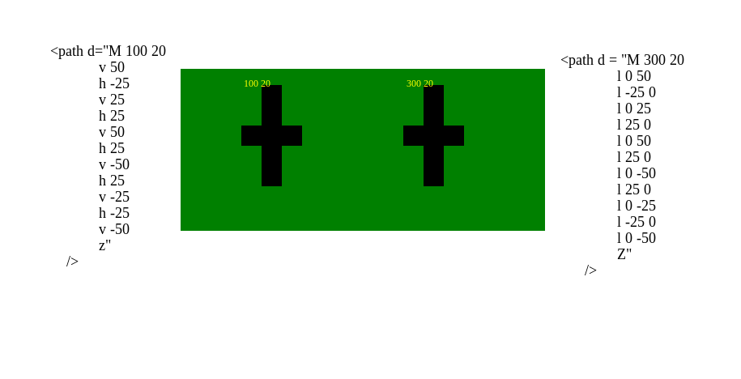

The above same figures was created using different commands to illustrate the  work of each command. 

Example using C for curved line
```html
<path d='M 50 50 C 100 100 200 100, 200 50' fill="white" stroke="blue" stroke-width="5"/>
```
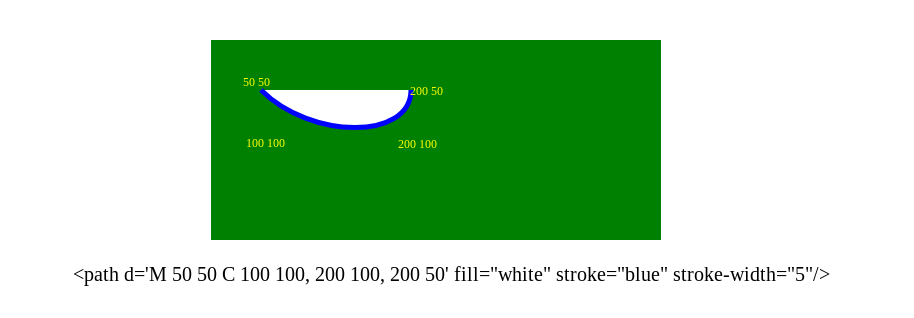

# Curve lines

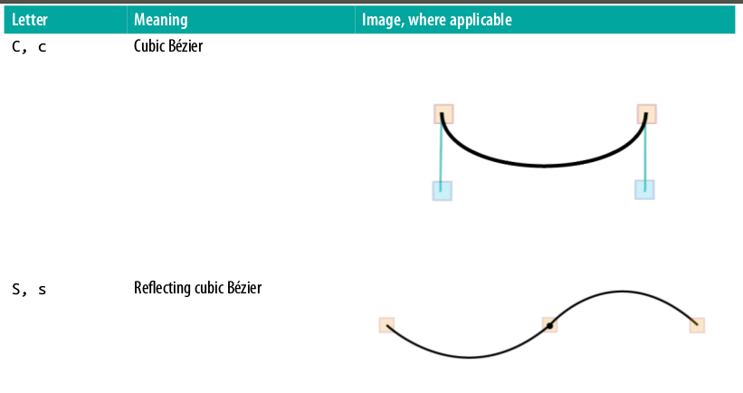

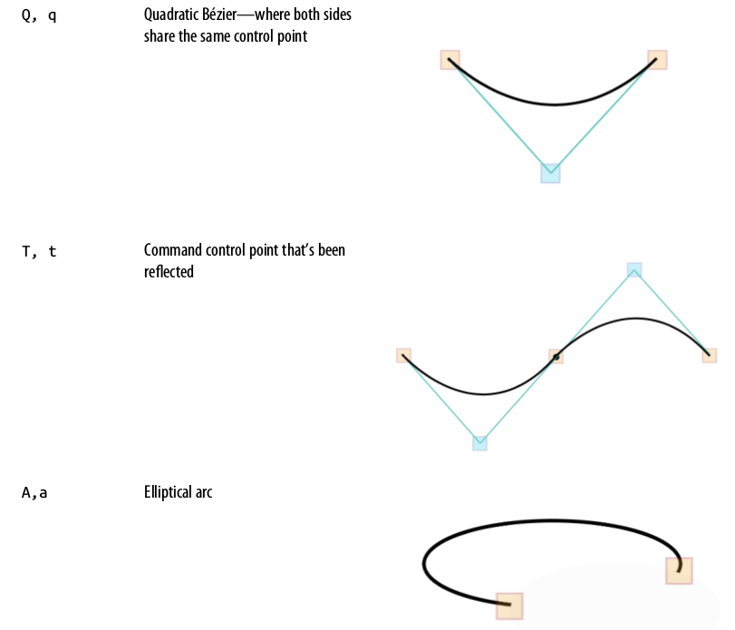


## Bézier curves
They are used to model smooth curves that can be scaled indefinitely.
>> A Bézier curve with one control point is called a quadratic Bézier curve and the kind with two control points is called cubic


