# SVG Scalable Vector Graphics

# **The Anatomy of an SVG**


### The Viewport
The viewport is the visible area of an SVG image. An SVG image can logically be as wide and high as you want, but only a certain part of the image can be visible at a time. The area that is visible is called the viewport. 
 It creates a “port” through which you can “view” a section of an SVG.
>>  **The SVG viewport is like a porthole window whose size determines what you can see through it but it doesn’t define the size of whatever might be visible through that viewport. What’s on the other side could theoretically be any size at all.**

The viewport is set by adding `width` and `height` to the svg tag.
#### For example
```html
<svg width="150px" height="150px">
  <rect x='0' y='0' width='200px' height='100px' fill="red"></rect>
  <circle cx='50px' cy='120px' r='50px'></circle>
</svg>
```
```css
svg {
    background: yellow;
  }
 ```

 

 From the image above, the the viewport is set to 150 by 150px.Therefore that will be the viscible part of the svg. What ever is contained inside remains the same but only the part that is contained within the 150 by 150 becomes viscible.
#### Example 2
```html
  <style>
      svg { background: green }
      rect { fill: blue   }
      circle {   fill: red }
      polygon {  fill: yellow  }
    </style>
  </head>

  <body>
    <svg x="0px" y="0px" width="250px" height="100px" viewBox="50 -10 100 50">
      <rect x="10" y="5" fill="white" stroke="black" width="90" height="90" />
      <circle fill="white" stroke="black" cx="170" cy="50" r="45" />
      <polygon fill="white" stroke="black" points="279,5 294,35 328,40 303,62
309,94 279,79 248,94 254,62 230,39 263,35" />
      <line fill="none" stroke="yellow" x1="410" y1="95" x2="440" y2="6" />
      <line fill="none" stroke="yellow" x1="360" y1="6" x2="360" y2="95" />
    </svg>

    <svg x="0px" y="0px" width="250px" height="100px" viewBox="0 0 500 200">
      <rect x="10" y="5" fill="white" stroke="black" width="90" height="90" />
      <circle fill="white" stroke="black" cx="170" cy="50" r="45" />
      <polygon fill="white" stroke="black" points="279,5 294,35 328,40 303,62
309,94 279,79 248,94 254,62 230,39 263,35" />
      <line fill="none" stroke="yellow" x1="410" y1="95" x2="440" y2="6" />
      <line fill="none" stroke="yellow" x1="360" y1="6" x2="360" y2="95" />
    </svg>
    <p>Paragraph</p>
```


### The ViewBox
Its is represented by a `viewbox` attribute with four numbers separated with a space and/or comma.
```html
 <svg width="150px" height="150px" viewbox='0 0 0 0'>
 </svg>
 ```
 `viewBox = <min-x> <min-y> <width> <height>`

The viewBox attribute defines the position and dimension, in user space, of an SVG viewport.
Taking it one after another, let me talk about what I mean by ... 
1. **Position**:       
This is determined from the first two numbers. It is sometimes seen as panning. From the code snippet above, the `viewbox` is et to `0 0 0 0`. The first two numbers which is `0 0` determines the position. Lets look at these examples


 While the height and width are maintained at 300 by 300, x and y are varied. Hope it is quite clear.

2. **Dimension**:   

This is determined by the last two numbers, ie the `width` and `height` parameters. If for instance, with `preserveAspectRatio` set to none, 

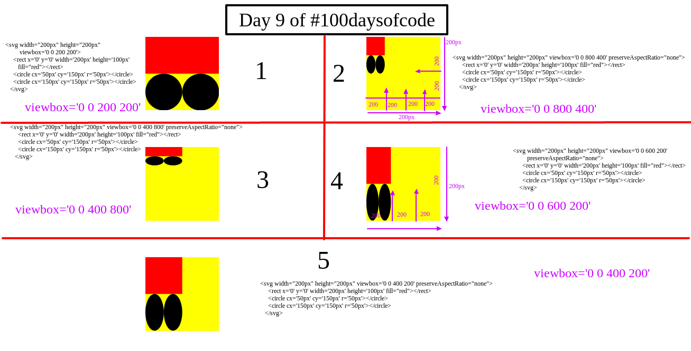
From the images above, in the second image section 2, the `viewbox='0 0 800 400' ` is while the `viewport` is `width="200px" height="200px"`. 

When, the `width` which is `800` is made equivalent to the `viewport width` which is `200px`. That means it is in the ration of `800 : 200px` == ` 4:1 `. Each inch of the `viewport` is equivalent to `4inch` of the `viewbox`. The same applies to the height dimension.


Think of viewbox as a virtual approach to **crop an image**.


Whenever you use the viewBox attribute, remember to set your viewport dimensions and preserveAspectRatio too. If you don’t,  you’ll likely have an oversized graphic:

>> if the viewport is like a window, the viewBox is like a telescope.


### Preserving Aspect Ratio
First of all,  when we talk   about aspect ratio, you  must know that it is the ratio of the width and height of the viewbox and  viewport

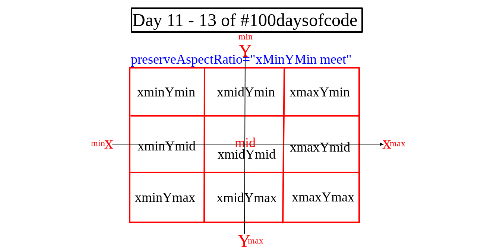

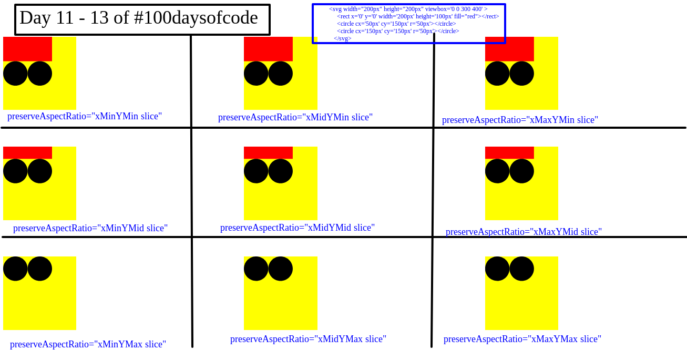

This topic is giving me headach, ma continue width  later. Moving on,


## Coordinate System
This is a bit different from the normal mathematical cordinates. By cordinate system, I mean the method of representing points in a space of given dimensions. For
#### Mathematical cordinate system
Along the horizontal axis, `x` increases while moving towards the right, and decreases whike moving towards the left. Then along the `vertical axis`, `y` increases while moving towards the top and decreases while moving downwards. 
#### SVG cordinate system
Along the `horizontal axis`, `x` increases while moving towards the right, and decreases whike moving towards the left. Then along the `vertical axis`, `y` decreases while moving towards the top and increases while moving downwards. 


## Coordinate System Units
If you do not specify any units inside the width and height attributes, the units are assumed to be pixels. That is, a width 500 means 500 pixels.

If you prefer to use different units than pixels, you can. Here is a list of the units you can use with the `<svg>` element: 

Unit| Description
---- | -------
em |	The default font size - usually the height of a character.
ex |	The height of the character x
px |	Pixels
pt |	Points (1 / 72 of an inch)
pc |	Picas (1 / 6 of an inch)
cm |	Centimeters
mm |	Millimeters
in |	Inches


## SVG g element
The SVG <g> element is used to group SVG shapes together. Once grouped you can style the whole group of shapes as if it was a single shape. 

For example
```html
 <svg width="200px" height="200px" viewbox='0 0 200 200' preserveAspectRatio ="none">
  <g>
    <rect x='0' y='0' width='200px' height='100px' fill="red"></rect>
    <circle cx='50px'  cy='150px' r='50px'></circle>
    <circle cx='150px'  cy='150px' r='50px'></circle>
  </g>
</svg>

```


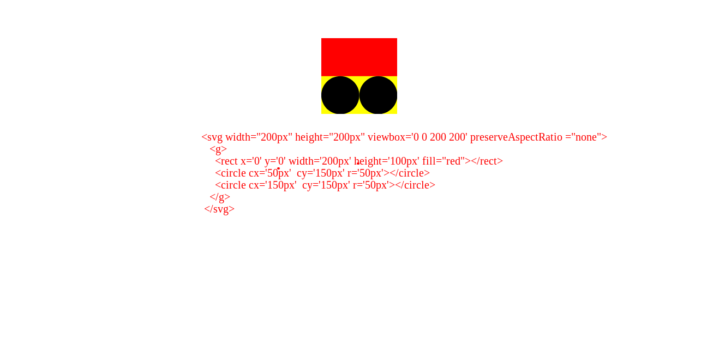

### The Styling of g Elements 
When you style an `svg` element, the styles affects the children as a single element. Let style the example above and see the effect

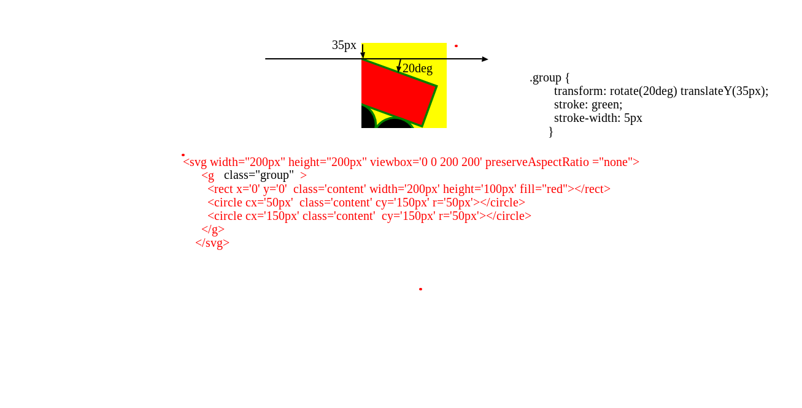

### Difference between styling a `g` element and a nested `svg` tag.
I have detailly designed an image that goes a long way to explaning the differences (well, i hope it does).

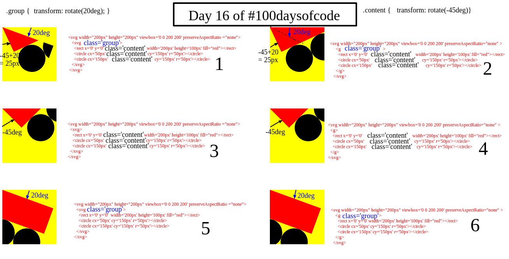

In section 1 from the above image, the contents are in a nested `svg` tags. The ` .group {transform: rotate(20deg) }` styles the `svg` tag directly housing the contents; `<rect></rect> <circle></circle> <circle></circle>`, while the cotents  are given a style of `.content { transform: rotate(-45deg) }`. 

Therefore, while the `svg` directly housing the contents   `rotates  20deg`; tilts downwards, the content from that position tilts upwards for `-45deg`.

The major difference between section 1 and 2 is that in section 1,  the contents are inclosed in an `svg` tag. This resulted to part of the contents not been visible since any content outside both  the inner and outer `svg` tag will not be seen . While in section 2, they are enclosed in a `g` tag, and will be visible.
Lets look at this image for btter clarification

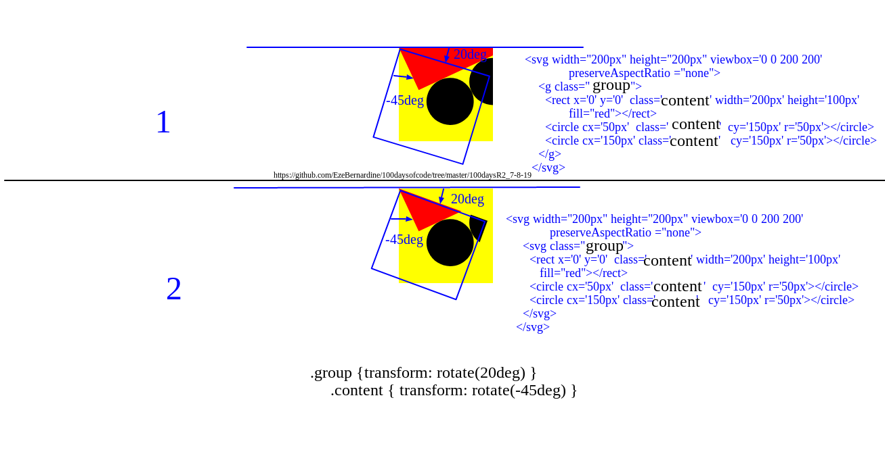

For section 3 to section 6, it is either the contents or the parent container that is atyled.


# **Drawing Shapes**

## Svg `rect`  element
This is done with the `rect` keyword. There are really only 6 basic attributes that control the position and shape of the rectangle on screen here

```html
 <rect x='40' y='20'  width='150'  height='50px' ></rect>
 ```
 

Dimensions | Meaning
------| ---------------
x  |    The x position of the top left corner of the rectangle.
y  |    The y position of the top left corner of the rectangle.
width|  The width of the rectangle
height | The height of the rectangle
rx  |   The x radius of the corners of the rectangle
ry |    The y radius of the corners of the rectangle 

## Svg circle element
This tag is used to create a circle, and it has only three attributes.
```html
<circle cx="25" cy="75" r="20"/>
```
attribute | meaning
--------|---------------
r  |  The radius of the circle.
cx |  The x position of the center of the circle.
cy |  The y position of the center of the circle.

**For exmple**
```html
<circle r='60' cy='110px' cx='100px'></circle>
```


## Svg ellipse 
This more of the general form of a circle. Here you can size or determine the x-radius and the y-radius callled the semi major and minor axis.
```html
<ellipse cx="75" cy="75" rx="20" ry="5"/>
``` 

attribute | meaning
--------|---------------
rx  |   The x radius of the ellipse.
ry  |   The y radius of the ellipse.
cx  |   The x position of the center of the ellipse.
cy  |   The y position of the center of the ellipse. 

## Svg Line element
As the name applies, it is used to draw lines.
```html
<line x1="200" x2="150" y1="50" y2="150" stroke='pink'/>
```


attribute | meaning
--------|---------------
x1 |   The x position of point 1.
y1 |    The y position of point 1.
x2 |    The x position of point 2.
y2 |   The y position of point 2. 

## Polyline
This is used to create a group of connected lines. It has on attribute; the `points` which is a list of all the points seperated with a coma

attribute | meaning
--------|---------------
points | Its a list of points, seperated by a comma. Each point must contain two numbers, an x coordinate and a y coordinate. So the list (0,0), (1,1) and (2,2) could be written: "0 0, 1 1, 2 2".

```html
  <stye>
      polygon {
        fill: black
      }
  </stye>
 <polyline points="60 150, 150 150, 200 50, 130 30, 50 50"/>
 ```
 

 ## Polygon
 Polygons are a lot like polylines in that they're composed of straight line segments connecting a list of points.
 ```html
  <polygon points="50 60, 100 100, 50 140, 50 60, 150 140, 150 60, 100 100"/>
  ```
attribute | meaning
--------|---------------
  points | It is a list of points sepereated with commas. Each point must contain two numbers, an x coordinate and a y coordinate. So the list (0,0), (1,1) and (2,2) could be written: "0 0, 1 1, 2 2". The drawing then closes the path, so a final straight line would be drawn from (2,2) to (0,0).
 

>>**The path automatically returns to the first point for you at the end, creating a closed shape**. 

For example
```html
 <polygon points="50 60, 100 100, 50 140, 50 60, 150 140, 150 60"/>
 ```
 


 # Path
It is used to create lines, curves, arcs and more. Path SVG can be executed by using the path tag.The `<path> `element in SVG is the ultimate drawing element. It can draw anything! The path element takes a single attribute to describe what it draws: the ` ` attribute.
M x,y |	Move to the absolute coordinates x,y

Serial number | attribute | meaning
-|--------|---------------
**straight lines**||
________________|________________ |____________________________________________________________________________
1 | M (x,y) |	Move to the absolute coordinates x,y
2 |m (x,y) |	Move to the right x and down y (or left and up if negative values) (The "Move To" command appears at the beginning of paths to specify where the drawing should start)
________________|________________ |____________________________________________________________________________
3 |L (x,y) |	Draw a straight line to the absolute coordinates x,y
4 |l (x,y ) |	Draw a straight line to a point that is relatively right x and down y (or left and up if negative values)
 ________________|________________ |____________________________________________________________________________
5 |H (x) |	Draw a line horizontally to the exact coordinate x
6 |h (x) |	Draw a line horizontally relatively to the right x (or to the left if a negative value)
 ________________|________________ |____________________________________________________________________________
7 |V( y) |	Draw a line vertically to the exact coordinate y
8 |v( y) |	Draw a line vertically relatively down y (or up if a negative value)
 | | |
9 |Z (or z) |	Draw a straight line back to the start of the path
**curve lines**||
________________|________________ |____________________________________________________________________________
10 |C  ( cX1,cY1 cX2,cY2 eX,eY) |	Draw a bezier curve based on two bezier control points and end at specified coordinates
11 |c | 	Same with all relative values
________________|________________ |____________________________________________________________________________
12 | S (cX2,cY2 eX,eY) |	Basically a C command that assumes the first bezier control point is a reflection of the last bezier point used in the previous S or C command
13 |s |	Same with all relative values
________________|________________ |____________________________________________________________________________
14 |Q (cX,cY eX,eY) |	Draw a bezier curve based a single bezier control point and end at specified coordinates
15 |q |	Same with all relative values
________________|________________ |____________________________________________________________________________
16 |T (eX,eY) |	Basically a Q command that assumes the first bezier control point is a reflection of the last bezier point used in the previous Q or T command
17 |t |	Same with all relative values
________________|________________ |____________________________________________________________________________
18 | A (rX,rY rotation, arc, sweep, eX,eY) |	Draw an arc that is based on the curve an oval makes. First define the width and height of the oval. Then the rotation of the oval. Along with the end point, this makes two possible ovals. So the arc and sweep are either 0 or 1 and determine which oval and which path it will take.
19 | a |	Same with relative values for eX,eY

>**Uppercase letters mean the position will absolutely positioned while lowercase letters mean relative positioning.**

For instance


    M 100,100 means "Pick up the pen and move it to the exact coordinates 100,100" ( this is absolute positioning)

    m 100,100 means "Move the Pen 100 down and 100 right from wherever you currently are." (this is relative positioning)

## Straight lines
Lets see an example
```html
<path d="M 100 20 v 50 h -25 v 25 h 25 v 50 h 25 v -50 h 25 v -25 h -25 v -50 z" />
<path d = "M 300 20  l 0 50 l -25 0 l 0 25 l 25 0 l 0 50 l 25 0 l 0 -50 l 25 0 l 0 -25 l -25 0 l 0 -50 Z"/>
```


The above same figures was created using different commands to illustrate the  work of each command. 


## Curve lines


We will be taking this part on after another for easy clarification

The first one is

### Cubic bezier curve


Cubic bezier curve syntax starts with `c` or `C` character inside the `path` attribute; 

` <path d='M150 50  C250 100, 50 200, 150 250' />`,

 or

 `<path d='M150 50  c100 50, -100 150, 0 200' />`. 

 The major difference between them is in the `c` character. One is in small case and the other, big case.  But, both will produce the same result. 

* Relative path

    The `c` character means relative path. `c100 50, -100 150, 0 200`. Here,
    * The first two numbers which are `100 50` is the `x1y1` value and the first control point.
    * The next two numbers `-100 150` is the `x2y2` value and the second control point.
    * While the last two numbers `0 200` is the end of the bezier curve.

    **How it works**  
    * The curve starts at `M150 50`, then the first control point sets in. The curve moves `100px ` in the `x` direction and `50px` in the `y` direction from the starting point; `M150 50`.

    * Next, the  curve moves `-100px` in the `x` direction which is to the left, and `150px` in the `y` direction  all from the starting point.

    * Finally. the curve ends at `0px` from the starting point and `200px` in the `y` direction from the starting point too.

* Absolute path

    The `C` character means relative path. `C250 100, 50 200, 150 250`. Here,
    * the first two numbers which are `250 100` is the `x1y1` value and the first control point.
    * The next two numbers ` 50 200` is the `x2y2` value and the second control point.
    * While the last two numbers `150 250` is the end of the bezier curve.

    **How it works**  
    * The curve starts at `M150 50`, then the first control point sets in. The curve moves  to point `250px ` on the `x` axis and `50px` in the `y` axis. 

    * Next, the  curve moves to point`50px` on the `x` axis , and `200px` in the `y` axis  .

    * Finally. the curve ends at point `150px` on the `x`  axis and `250px` on the `y` axis.

### **Note**   
You can move the control points to increase or decrease the curve. It is not the exact point the control points stops at that the curve edge will stop.

Here is an example

```html
<g>
  <svg width="400px" height="400px" viewbox='0 0 400 400' preserveAspectRatio="none">
    <path d='M150 50  C250 100, 50 200, 150 250' />
  </svg>
  <svg width="400px" height="400px" viewbox='0 0 400 400' preserveAspectRatio="none">
    <path d='M150 50  c100 50, -100 150, 0 200' />
  </svg>
</g>
```
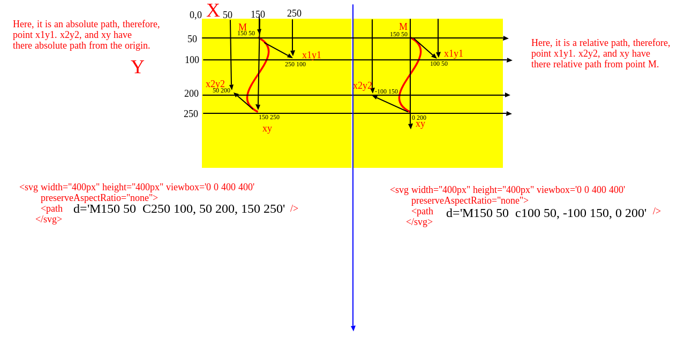


### Smooth Cubic bezier curve


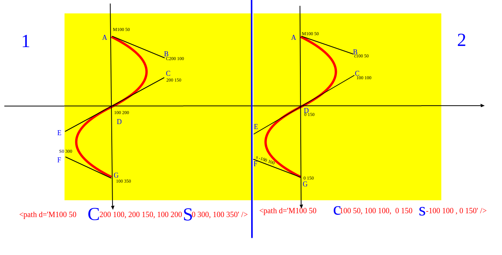

This is creates a more smoother curve than  `cubic bezier`. It works width the `c` or `C`  command just like the `cubic bezier`,  but together with another  command; the `S` or `s`  command.

The **`s` or `S`**  command comes after the **`c` or `C`**  command. While the **`c` or `C`**  command has two control points, the **`s` or `S`**  command, has one. The second control point from the **`c` or `C`**  command, extends to form a control point for the **`s` or `S`**  command. This together with the control point from the **`s`s or `S`**  command, gives the **`s` or `S`**  command two control points in total. One from the **`c` or `C`**, and the other from its self.

For example

Lets look at Smooth Cubic bezier curve for relative path.
```html

      <svg width="700px" height="700px" viewbox='0 0 400 400' 
        preserveAspectRatio="none">
        <path d='M100 50  c100 50, 100 100,  0 150 s -100 100 , 0 150' />
      </svg>
```
#### Relative path
  * About Relative path     
    The `c` character means relative path. `c100 50, 100 100,  0 150 s -100 100 , 0 150`. Here,
    * The first two numbers which are `100 50` is the `x1y1` value and the first control point.
    * The next two numbers `100 100` is the `x2y2` value and the second control point.
    * The last two numbers before the `s`; ` 0 150` is the end of the first half of the  bezier curve.
    
    **Then the `s` sets in.**
    * The first two numbers after the `s`; ` -100 100` is the second control point for the `s`  command. 

    **Note**  
    * The first control point for the `s`  command is the end point of the second control point of the `c`  command which is point **E**.
    * While the second control point of the `s`  command is point **F** `-100 100 `.
   
    **How it works**  
    * The curve starts at `'M100 50 `, then moves towards the first control point which is at  `100px ` in the `x` direction and `50px` in the `y` direction. All measurement taken  relative to  the starting point; `M`.
    * Next, the  curve moves towards the second control point which is at `100px` in the `x` direction, and `100px` in the `y` direction . All measurement taken  relative to the starting point `M `.
    * Next. the curve ends at `0px` in the `x` direction and `150px` in the `y` direction temporarily .All measurement taken  relative to the starting point `M `.
    * Next, the curve automatically moves towards point **F** which as I said earlier,  the first control point for the `s`  command. **Note**: In this case, measurement is taken  relative to the end point for `c`  command; which is at point **D** (`0 150`).
    * Next, the curve moves towards the second control point of the `s`  command which is point **F**, ` -100px` in the `x` direction and `100px` in the `y` direction. **Note**: In this case, measurement is taken  relative to the end point of `c`  command; which is point **D** ( ` 0 150`).
    * Finally, the curve end at point **G** `0px` in the `x` direction and `150px` in the `y` direction.  **Note**: In this case also, measurement is taken  relative to end point of curve `c`  command; which is  at point **D** (` 0 150`).

    **In General,**  
    * All point in-between `c` and `s` which are  **B**, **C** and **D** (`c 100 50, 100 100,  0 150 s ...`) are all taken relative to point **M** (`100 50 `).
    * While all points after `s` which are **E**, **F** and **G** (`...s -100 100 , 0 150`) are taken relative to the last point of the `c`  command which is **D** (` 0 150`).


 Smooth Cubic bezier curve for absolute path.
####  Absolute path
```html
  <svg width="700px" height="700px" viewbox='0 0 400 400' 
    preserveAspectRatio="none">
    <path d='M100 50  C200 100, 200 150, 100 200 S 0 300, 100 350' />
  </svg>

```

  * About Absolute path   
    The `C` character means absolute path. `C200 100, 200 150, 100 200 S 0 300, 100 350'`. Here,
       * The first two numbers which are `200 100` is the `x1y1` value and the first control point.
      * The next two numbers `200 150` is the `x2y2` value and the second control point.
      * The last two numbers before the `s`; `100 200`  is the end of the first half of the  bezier curve.

      **How it works**  
      * The curve starts at `'M100 50 `, then moves towards the first control point which is at point **B** `200px ` in the `x` direction and `150px` in the `y` direction. All measurement are taken from the origin ; point `0 0` (absolute).
      * Next, the  curve moves towards the second control point which is at point **C** `200px` in the `x` direction, and `150px` in the `y` direction .  All measurement are taken from the origin; point `0 0` (absolute).
      * Next. the curve ends at point  **D** `100px` in the `x` direction and `200px` in the `y` direction temporarily .  All measurement are taken from the origin; point `0 0` (absolute).
      * Next, the curve automatically moves towards point F which as I said earlier,  the first control point for the `s`  command.  All measurement are taken from the origin ; point `0 0` (absolute).
      * Next, the curve moves towards the second control point of the `s` command which is point **F**, ` 0px` in the `x` direction and `300px` in the `y` direction. All measurement are taken from the origin ; point `0 0` (absolute).
      * Finally, the curve end at point **G** `100px` in the `x` direction and `350px` in the `y` direction.  All measurement are taken from the origin ; point `0 0` (absolute).

### Quadratic Bézier Curve Commands
This creates a quadratic curve. It uses the `q` or `Q` command. Unlike the  `cubic bezier curve`, `Quadratic Bézier Curve ` hava just a single cntrol point. Let takes a look at this image

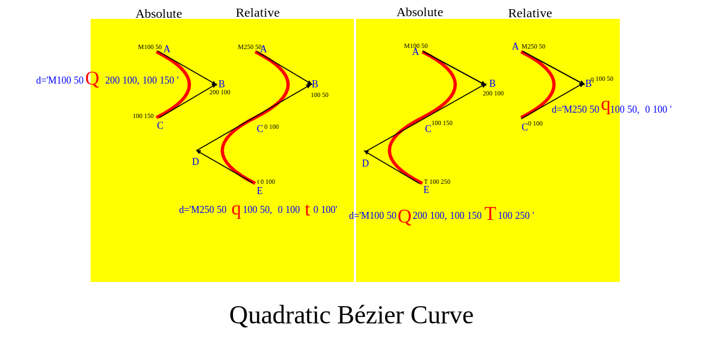

There are four images there. In this section, I will be taking about the first and the last images. These two images are created using the `Q` and `q` commands. Starting with the first one.

####  Absolute path
```html
  <svg width="700px" height="700px" viewbox='0 0 400 400' preserveAspectRatio="none">
    <path d='M100 50 Q 200 100, 100 150'  />
  </svg>

```

  * About Absolute path   
    The `Q` character represents absolute path. `Q 200 100, 100 150'`. Here,
       * The first two numbers which are `200 100` is the `x1  y1` value and the only control point.
      * The last two numbers `100 150` are the `dx dy` values and the end of the curve.

      **How it works**  
      * The curve starts at point **A** `'M100 50 `, then moves towards the control point which is at point **B** `200px ` in the `x` direction and `100px` in the `y` direction. All measurement are taken from the origin ; point `0 0` (absolute).
      * Finally, the curve ends at point **C** `100px` in the `x` direction and `150px` in the `y` direction.  All measurement are taken from the origin ; point `0 0` (absolute).

For relative path, we have
```html
  <svg width="700px" height="700px" viewbox='0 0 400 400' 
    preserveAspectRatio="none">
    <path d='M250 50 q 100 50,  0 100   ' />
  </svg>
```
#### Relative path
  * About Relative path     
    The `q` character means relative path. `q 100 50,  0 100  `. Here,
    * The first two numbers which are `100 50` is the `x1 y1` value and the only control point.
    * The next two numbers `100 100` is the `x2 y2` value and end of the curve.
    
    
    **How it works**  
      * The curve starts at point **A** `'M100 50 `, then moves towards the  control point which is at point **B** `100px` in the `x` direction and `50px` in the `y` direction. **Note**: In this case , measurement is taken  relative to  point  **A** which is  at  (` 100 50`).
      * Finally, the curve ends at point **C** `0px` in the `x` direction and `100px` in the `y` direction. **Note**: In this case also, measurement is taken  relative to point **A** (`100 50`).

### Smoother Quadratic Bézier Curve Commands
This makes the` quadratic bezier curve` smoother just like  we have `Smooth Cubic bezier curve` makes `Cubic bezier curve` smoother.

Adding some lines accross them for more explanation,

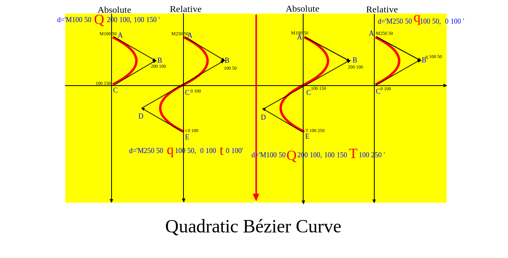

### Arcs
  Will have grt back to this concept later.

## Fills and Strokes

1. **fill**
    * sets the color inside the object and 
2. **stroke-dasharray**
    * It takes a series of comma-separated numbers as its argument. 
3. **stroke-dashoffset**
    * specifies where to start a dasharray on a line.
      * Vales: numeric value or percentage (em or px is not required) Percentage is relative to the percent of the current viewport.

4. **stroke-linecap**
    * values   
      * butt
      * square
      * round 
5. **stroke-width**
6. **fill-opacity**  
    * The fill-opacity specifies the opacity of  the fill
7. **stroke-opacity**
    * stroke-opacity attributes, specifies the opacity of the  stroke 
8. **stroke-linejoin**
    * values
       * miter
       * round
       * bevel
9. **fill-rule**
    * specifies how to color in shapes that overlap themselves
10. **stroke-miterlimit**
    * determines if a stroke should draw miters


### `fill` and `stroke`
`fill` sets the color inside the object and `stroke` sets the color of the line drawn around the object. 

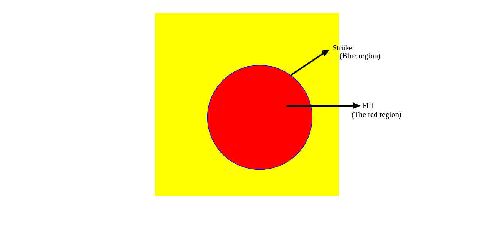
```html
<style>
  svg {
    background: yellow;
  }

  circle {
    fill: red;
    stroke: blue
  }
</style>

 <svg width="700px" height="700px" viewbox='0 0 350 350' preserveAspectRatio="none">
   <circle cx='200' cy='200' r='100px'>
     </svg>
```
### `fill-opacity`
This reduces the opaque nature of an svg. `i` sets it to perfect opaque, while `0` sets it to completely transparent. . `.5` makes it a little opaque and a little transparent.

For example, 

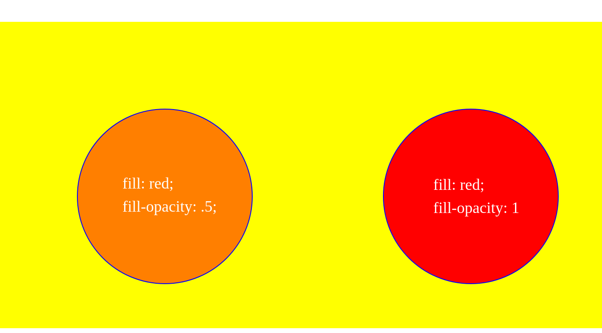.

```hhtl
<g>
  <svg width="700px" height="700px" viewbox='0 0 350 350' preserveAspectRatio="none">
    <circle cx='200' cy='200' r='100px' fill-opacity=.5 fill: 'red'>
  </svg>
</g>
<g>
  <svg width="700px" height="700px" viewbox='0 0 350 350' preserveAspectRatio="none">
    <circle cx='200' cy='200' r='100px' fill-opacity=1 fill: 'red'>
  </svg>
</g>
```

### **`stroke-dasharray`**
This has effect on on ` <altGlyph>, <circle>, <ellipse>, <path>, <line>, <polygon>, <polyline>, <rect>, <text>, <textPath>, <tref>,` and `<tspan>`
```html
<style>
  circle {
      stroke: blue;
      stroke-width: 5px;
    }
    .first {
      fill: red;
      stroke-dasharray: 20%
    }
    .sec {
      stroke-dasharray: 50px 20 5 30;
      fill: purple
    }
    .third {
      fill: pink;
      stroke-dasharray: 20 1 5
    } 
    .fourth {
      fill: orange;
      stroke-dasharray: 200px 
    } 
  </style>
<body>
  <g>
    <svg width="400px" height="400px" viewbox='0 0 350 350' preserveAspectRatio="none">
      <circle cx='200' cy='200' r='100px' class="first">
    </svg>
  </g>
  <g>
    <svg width="400px" height="400px" viewbox='0 0 350 350' preserveAspectRatio="none">
      <circle cx='200' cy='200' r='100px'class="sec">
    </svg>
  </g>
  <g>
    <svg width="400px" height="400px" viewbox='0 0 350 350' preserveAspectRatio="none">
      <circle cx='200' cy='200' r='100px'class="third">
    </svg>
  </g>
  <g>
    <svg width="400px" height="400px" viewbox='0 0 350 350' preserveAspectRatio="none">
      <circle cx='200' cy='200' r='100px'class="fourth">
    </svg>
  </g>
</body>
```

The `stroke-dasharray` property in CSS is for creating dashes in the stroke of SVG shapes. The higher the number, the more space in between dashes in the stroke. tHe svg image must have a stroke attribute for it to work.
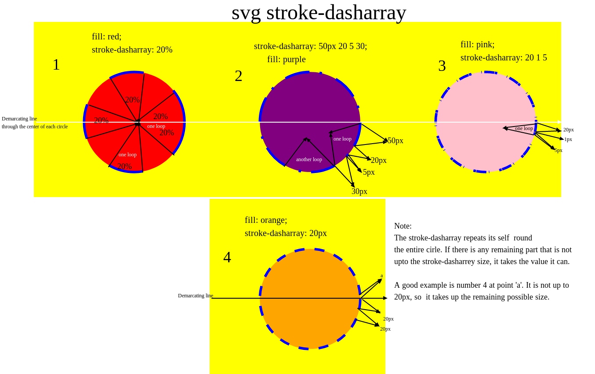.

###  **`stroke-dashoffset`**'
 The stroke-dashoffset is used to set how far into dash pattern to start the pattern. That way you can start the dashing from e.g. halfway into the pattern, and then repeat the pattern from there [jenkov.com](http://tutorials.jenkov.com/svg/stroke.html#stroke-dasharray-stroke-dashoffset)

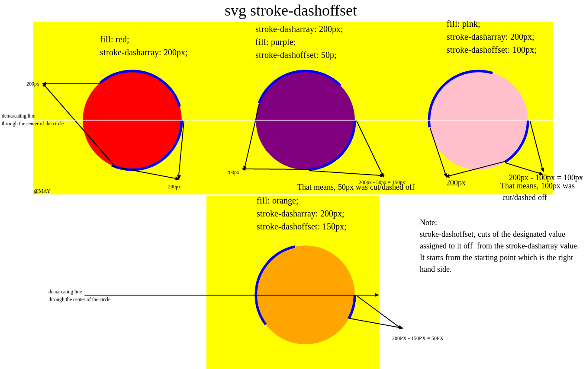.

Adding a bit of animation to the code above, we have
```html
<style>

    .first {
      fill: red;
      stroke-dasharray: 0;
      animation: dashes 5s linear infinite;
    }

    .sec {
      stroke-dasharray: 200px;
      fill: purple;
      animation: sec 5s linear infinite;
    }

    .third {
      fill: pink;
      stroke-dasharray: 200px;
      animation: dashes 5s linear infinite;
    }
    @keyframes sec {
      from {
        stroke-dashoffset: 0
      }

      to {
        stroke-dashoffset: 1000
      }
    }

    @keyframes dashes {
      from {
        stroke-dashoffset: 0
      }

      to {
        stroke-dashoffset: 100
      }
    }
</style>

  <g>
    <svg width="400px" height="400px" viewbox='0 0 350 350' preserveAspectRatio="none">
      <circle cx='200' cy='200' r='100px' class="first">
    </svg>
  </g>
  <g>
    <svg width="400px" height="400px" viewbox='0 0 350 350' preserveAspectRatio="none">
      <circle cx='200' cy='200' r='100px' class="sec">
    </svg>
  </g>
  <g>
    <svg width="400px" height="400px" viewbox='0 0 350 350' preserveAspectRatio="none">
      <circle cx='200' cy='200' r='100px' class="third">
    </svg>
  </g>
```

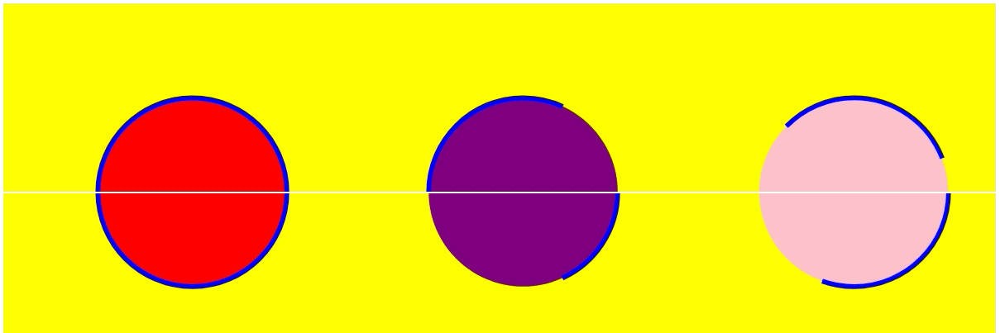.

The white accross the screen shows the center of the circles. It helps show when the animation starts and ends.

### **`stroke-linecap`**
stroke-linecap determines how an svg line will look like. If you  add stroke-width, how will the edges of the stroke width look like.

It has three values, `butt`, `square`, and `round`. Both `round` and `square` adds a little lenght to the line, while `butt` does not.

The edges of `butt` and `square` are the same; 90deg edges, while `round` has rounded edges.

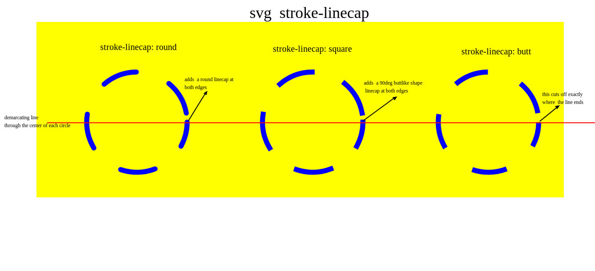.