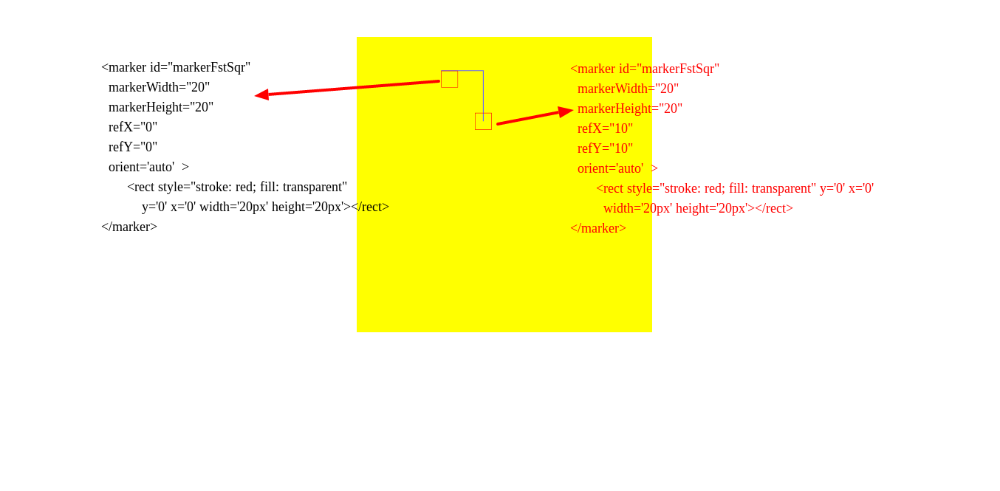
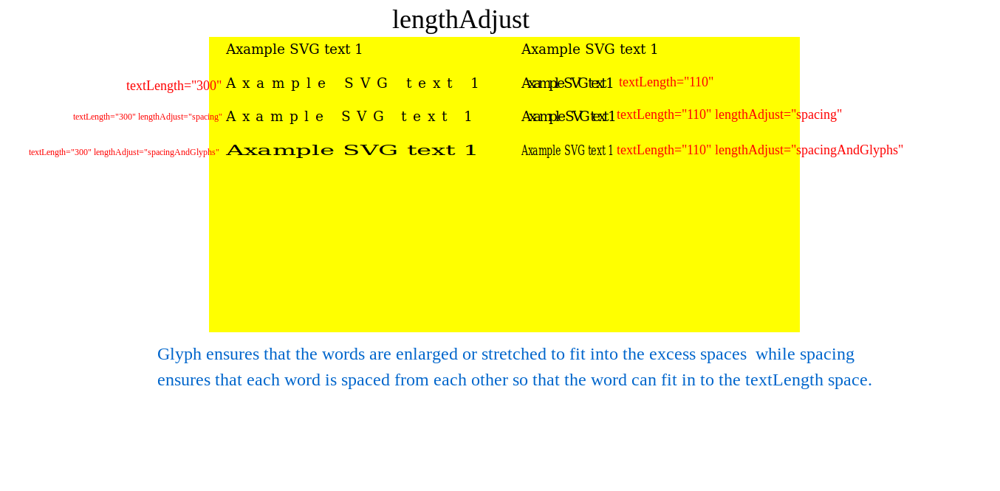
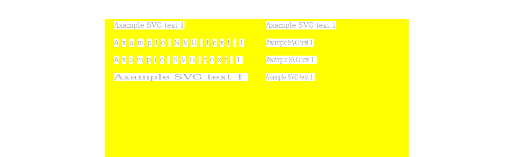
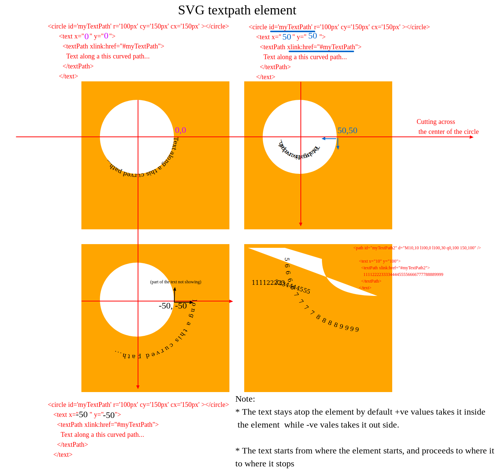

# **Drawing Shapes**

## Straight lines

Lets see an example

```html
<path
  d="M 100 20 v 50 h -25 v 25 h 25 v 50 h 25 v -50 h 25 v -25 h -25 v -50 z"
/>
<path
  d="M 300 20  l 0 50 l -25 0 l 0 25 l 25 0 l 0 50 l 25 0 l 0 -50 l 25 0 l 0 -25 l -25 0 l 0 -50 Z"
/>
```


The above same figures was created using different commands to illustrate the work of each command.


## Curve lines


We will be taking this part on after another for easy clarification

The first one is

### Cubic bezier curve

Cubic bezier curve syntax starts with `c` or `C` character inside the `path` attribute;

`<path d='M150 50 C250 100, 50 200, 150 250' />`,

or

`<path d='M150 50 c100 50, -100 150, 0 200' />`.

The major difference between them is in the `c` character. One is in small case and the other, big case. But, both will produce the same result.

- Relative path

  The `c` character means relative path. `c100 50, -100 150, 0 200`. Here,

  - The first two numbers which are `100 50` is the `x1y1` value and the first control point.
  - The next two numbers `-100 150` is the `x2y2` value and the second control point.
  - While the last two numbers `0 200` is the end of the bezier curve.

  **How it works**

  - The curve starts at `M150 50`, then the first control point sets in. The curve moves `100px` in the `x` direction and `50px` in the `y` direction from the starting point; `M150 50`.

  - Next, the curve moves `-100px` in the `x` direction which is to the left, and `150px` in the `y` direction all from the starting point.

  - Finally. the curve ends at `0px` from the starting point and `200px` in the `y` direction from the starting point too.

- Absolute path

  The `C` character means relative path. `C250 100, 50 200, 150 250`. Here,

  - the first two numbers which are `250 100` is the `x1y1` value and the first control point.
  - The next two numbers `50 200` is the `x2y2` value and the second control point.
  - While the last two numbers `150 250` is the end of the bezier curve.

  **How it works**

  - The curve starts at `M150 50`, then the first control point sets in. The curve moves to point `250px` on the `x` axis and `50px` in the `y` axis.

  - Next, the curve moves to point`50px` on the `x` axis , and `200px` in the `y` axis .

  - Finally. the curve ends at point `150px` on the `x` axis and `250px` on the `y` axis.

### **Note**

You can move the control points to increase or decrease the curve. It is not the exact point the control points stops at that the curve edge will stop.

Here is an example

```html
<g>
  <svg
    width="400px"
    height="400px"
    viewbox="0 0 400 400"
    preserveAspectRatio="none"
  >
    <path d="M150 50  C250 100, 50 200, 150 250" />
  </svg>
  <svg
    width="400px"
    height="400px"
    viewbox="0 0 400 400"
    preserveAspectRatio="none"
  >
    <path d="M150 50  c100 50, -100 150, 0 200" />
  </svg>
</g>
```


### Smooth Cubic bezier curve


This is creates a more smoother curve than `cubic bezier`. It works width the `c` or `C` command just like the `cubic bezier`, but together with another command; the `S` or `s` command.

The **`s` or `S`** command comes after the **`c` or `C`** command. While the **`c` or `C`** command has two control points, the **`s` or `S`** command, has one. The second control point from the **`c` or `C`** command, extends to form a control point for the **`s` or `S`** command. This together with the control point from the **`s`s or `S`** command, gives the **`s` or `S`** command two control points in total. One from the **`c` or `C`**, and the other from its self.

For example

Lets look at Smooth Cubic bezier curve for relative path.

```html
<svg
  width="700px"
  height="700px"
  viewbox="0 0 400 400"
  preserveAspectRatio="none"
>
  <path d="M100 50  c100 50, 100 100,  0 150 s -100 100 , 0 150" />
</svg>
```

#### Relative path

- About Relative path  
  The `c` character means relative path. `c100 50, 100 100, 0 150 s -100 100 , 0 150`. Here,

  - The first two numbers which are `100 50` is the `x1y1` value and the first control point.
  - The next two numbers `100 100` is the `x2y2` value and the second control point.
  - The last two numbers before the `s`; `0 150` is the end of the first half of the bezier curve.

  **Then the `s` sets in.**

  - The first two numbers after the `s`; `-100 100` is the second control point for the `s` command.

  **Note**

  - The first control point for the `s` command is the end point of the second control point of the `c` command which is point **E**.
  - While the second control point of the `s` command is point **F** `-100 100`.

  **How it works**

  - The curve starts at `'M100 50`, then moves towards the first control point which is at `100px` in the `x` direction and `50px` in the `y` direction. All measurement taken relative to the starting point; `M`.
  - Next, the curve moves towards the second control point which is at `100px` in the `x` direction, and `100px` in the `y` direction . All measurement taken relative to the starting point `M`.
  - Next. the curve ends at `0px` in the `x` direction and `150px` in the `y` direction temporarily .All measurement taken relative to the starting point `M`.
  - Next, the curve automatically moves towards point **F** which as I said earlier, the first control point for the `s` command. **Note**: In this case, measurement is taken relative to the end point for `c` command; which is at point **D** (`0 150`).
  - Next, the curve moves towards the second control point of the `s` command which is point **F**, `-100px` in the `x` direction and `100px` in the `y` direction. **Note**: In this case, measurement is taken relative to the end point of `c` command; which is point **D** ( `0 150`).
  - Finally, the curve end at point **G** `0px` in the `x` direction and `150px` in the `y` direction. **Note**: In this case also, measurement is taken relative to end point of curve `c` command; which is at point **D** (`0 150`).

  **In General,**

  - All point in-between `c` and `s` which are **B**, **C** and **D** (`c 100 50, 100 100, 0 150 s ...`) are all taken relative to point **M** (`100 50`).
  - While all points after `s` which are **E**, **F** and **G** (`...s -100 100 , 0 150`) are taken relative to the last point of the `c` command which is **D** (`0 150`).

Smooth Cubic bezier curve for absolute path.

#### Absolute path

```html
<svg
  width="700px"
  height="700px"
  viewbox="0 0 400 400"
  preserveAspectRatio="none"
>
  <path d="M100 50  C200 100, 200 150, 100 200 S 0 300, 100 350" />
</svg>
```

- About Absolute path  
  The `C` character means absolute path. `C200 100, 200 150, 100 200 S 0 300, 100 350'`. Here,

  - The first two numbers which are `200 100` is the `x1y1` value and the first control point.
  - The next two numbers `200 150` is the `x2y2` value and the second control point.
  - The last two numbers before the `s`; `100 200` is the end of the first half of the bezier curve.

  **How it works**

  - The curve starts at `'M100 50`, then moves towards the first control point which is at point **B** `200px` in the `x` direction and `150px` in the `y` direction. All measurement are taken from the origin ; point `0 0` (absolute).
  - Next, the curve moves towards the second control point which is at point **C** `200px` in the `x` direction, and `150px` in the `y` direction . All measurement are taken from the origin; point `0 0` (absolute).
  - Next. the curve ends at point **D** `100px` in the `x` direction and `200px` in the `y` direction temporarily . All measurement are taken from the origin; point `0 0` (absolute).
  - Next, the curve automatically moves towards point F which as I said earlier, the first control point for the `s` command. All measurement are taken from the origin ; point `0 0` (absolute).
  - Next, the curve moves towards the second control point of the `s` command which is point **F**, `0px` in the `x` direction and `300px` in the `y` direction. All measurement are taken from the origin ; point `0 0` (absolute).
  - Finally, the curve end at point **G** `100px` in the `x` direction and `350px` in the `y` direction. All measurement are taken from the origin ; point `0 0` (absolute).

### Quadratic Bézier Curve Commands

This creates a quadratic curve. It uses the `q` or `Q` command. Unlike the `cubic bezier curve`, `Quadratic Bézier Curve` hava just a single cntrol point. Let takes a look at this image


There are four images there. In this section, I will be taking about the first and the last images. These two images are created using the `Q` and `q` commands. Starting with the first one.

#### Absolute path

```html
<svg
  width="700px"
  height="700px"
  viewbox="0 0 400 400"
  preserveAspectRatio="none"
>
  <path d="M100 50 Q 200 100, 100 150" />
</svg>
```

- About Absolute path  
  The `Q` character represents absolute path. `Q 200 100, 100 150'`. Here,

  - The first two numbers which are `200 100` is the `x1 y1` value and the only control point.
  - The last two numbers `100 150` are the `dx dy` values and the end of the curve.

  **How it works**

  - The curve starts at point **A** `'M100 50`, then moves towards the control point which is at point **B** `200px` in the `x` direction and `100px` in the `y` direction. All measurement are taken from the origin ; point `0 0` (absolute).
  - Finally, the curve ends at point **C** `100px` in the `x` direction and `150px` in the `y` direction. All measurement are taken from the origin ; point `0 0` (absolute).

For relative path, we have

```html
<svg
  width="700px"
  height="700px"
  viewbox="0 0 400 400"
  preserveAspectRatio="none"
>
  <path d="M250 50 q 100 50,  0 100   " />
</svg>
```

#### Relative path

- About Relative path  
  The `q` character means relative path. `q 100 50, 0 100`. Here,

  - The first two numbers which are `100 50` is the `x1 y1` value and the only control point.
  - The next two numbers `100 100` is the `x2 y2` value and end of the curve.

  **How it works**

  - The curve starts at point **A** `'M100 50`, then moves towards the control point which is at point **B** `100px` in the `x` direction and `50px` in the `y` direction. **Note**: In this case , measurement is taken relative to point **A** which is at (`100 50`).
  - Finally, the curve ends at point **C** `0px` in the `x` direction and `100px` in the `y` direction. **Note**: In this case also, measurement is taken relative to point **A** (`100 50`).

### Smoother Quadratic Bézier Curve Commands

This makes the`quadratic bezier curve` smoother just like we have `Smooth Cubic bezier curve` makes `Cubic bezier curve` smoother.

Adding some lines accross them for more explanation,


### Arcs

Will have to go back to this concept later.

## Fills and Strokes

1. **fill**
   - sets the color inside the object and
2. **stroke-dasharray**
   - It takes a series of comma-separated numbers as its argument.
3. **stroke-dashoffset**

   - specifies where to start a dasharray on a line.
     - Vales: numeric value or percentage (em or px is not required) Percentage is relative to the percent of the current viewport.

4. **stroke-linecap**
   - values
     - butt
     - square
     - round
5. **stroke-width**
6. **fill-opacity**
   - The fill-opacity specifies the opacity of the fill
7. **stroke-opacity**
   - stroke-opacity attributes, specifies the opacity of the stroke
8. **stroke-linejoin**
   - values
     - miter
     - round
     - bevel
     - crop
     - arcs
9. **fill-rule**
   - specifies how to color in shapes that overlap themselves
   - Value
     - nonzero
     - evenodd
10. **stroke-miterlimit**
    - determines if a stroke should draw miters

### `fill` and `stroke`

`fill` sets the color inside the object and `stroke` sets the color of the line drawn around the object.


```html
<style>
  svg {
    background: yellow;
  }

  circle {
    fill: red;
    stroke: blue
  }
</style>

 <svg width="700px" height="700px" viewbox='0 0 350 350' preserveAspectRatio="none">
   <circle cx='200' cy='200' r='100px'>
     </svg>
```

### `fill-opacity`

This reduces the opaque nature of an svg. `i` sets it to perfect opaque, while `0` sets it to completely transparent. . `.5` makes it a little opaque and a little transparent.

For example,

.

```hhtl
<g>
  <svg width="700px" height="700px" viewbox='0 0 350 350' preserveAspectRatio="none">
    <circle cx='200' cy='200' r='100px' fill-opacity=.5 fill: 'red'>
  </svg>
</g>
<g>
  <svg width="700px" height="700px" viewbox='0 0 350 350' preserveAspectRatio="none">
    <circle cx='200' cy='200' r='100px' fill-opacity=1 fill: 'red'>
  </svg>
</g>
```

### **`stroke-dasharray`**

This has effect on on `<altGlyph>, <circle>, <ellipse>, <path>, <line>, <polygon>, <polyline>, <rect>, <text>, <textPath>, <tref>,` and `<tspan>`

```html
<style>
  circle {
      stroke: blue;
      stroke-width: 5px;
    }
    .first {
      fill: red;
      stroke-dasharray: 20%
    }
    .sec {
      stroke-dasharray: 50px 20 5 30;
      fill: purple
    }
    .third {
      fill: pink;
      stroke-dasharray: 20 1 5
    }
    .fourth {
      fill: orange;
      stroke-dasharray: 200px
    }
  </style>
<body>
  <g>
    <svg width="400px" height="400px" viewbox='0 0 350 350' preserveAspectRatio="none">
      <circle cx='200' cy='200' r='100px' class="first">
    </svg>
  </g>
  <g>
    <svg width="400px" height="400px" viewbox='0 0 350 350' preserveAspectRatio="none">
      <circle cx='200' cy='200' r='100px'class="sec">
    </svg>
  </g>
  <g>
    <svg width="400px" height="400px" viewbox='0 0 350 350' preserveAspectRatio="none">
      <circle cx='200' cy='200' r='100px'class="third">
    </svg>
  </g>
  <g>
    <svg width="400px" height="400px" viewbox='0 0 350 350' preserveAspectRatio="none">
      <circle cx='200' cy='200' r='100px'class="fourth">
    </svg>
  </g>
</body>
```

The `stroke-dasharray` property in CSS is for creating dashes in the stroke of SVG shapes. The higher the number, the more space in between dashes in the stroke. tHe svg image must have a stroke attribute for it to work.
.

### **`stroke-dashoffset`**'

The stroke-dashoffset is used to set how far into dash pattern to start the pattern. That way you can start the dashing from e.g. halfway into the pattern, and then repeat the pattern from there [jenkov.com](http://tutorials.jenkov.com/svg/stroke.html#stroke-dasharray-stroke-dashoffset)

.

Adding a bit of animation to the code above, we have

```html
<style>

    .first {
      fill: red;
      stroke-dasharray: 0;
      animation: dashes 5s linear infinite;
    }

    .sec {
      stroke-dasharray: 200px;
      fill: purple;
      animation: sec 5s linear infinite;
    }

    .third {
      fill: pink;
      stroke-dasharray: 200px;
      animation: dashes 5s linear infinite;
    }
    @keyframes sec {
      from {
        stroke-dashoffset: 0
      }

      to {
        stroke-dashoffset: 1000
      }
    }

    @keyframes dashes {
      from {
        stroke-dashoffset: 0
      }

      to {
        stroke-dashoffset: 100
      }
    }
</style>

  <g>
    <svg width="400px" height="400px" viewbox='0 0 350 350' preserveAspectRatio="none">
      <circle cx='200' cy='200' r='100px' class="first">
    </svg>
  </g>
  <g>
    <svg width="400px" height="400px" viewbox='0 0 350 350' preserveAspectRatio="none">
      <circle cx='200' cy='200' r='100px' class="sec">
    </svg>
  </g>
  <g>
    <svg width="400px" height="400px" viewbox='0 0 350 350' preserveAspectRatio="none">
      <circle cx='200' cy='200' r='100px' class="third">
    </svg>
  </g>
```

.

The white accross the screen shows the center of the circles. It helps show when the animation starts and ends.

### **`stroke-linecap`**

stroke-linecap determines how an svg line will look like. If you add stroke-width, how will the edges of the stroke width look like.

It has three values, `butt`, `square`, and `round`. Both `round` and `square` adds a little lenght to the line, while `butt` does not.

The edges of `butt` and `square` are the same; 90deg edges, while `round` has rounded edges.

.

### **stroke-linejoin**

The stroke-linejoin CSS property defines how the join between two lines in a shape is rendered

### **stroke-miterlimit**

The stroke-miterlimit CSS propety is used together with the stroke-linejoin CSS property. If stroke-linejoin is set to miter, then the stroke-miterlimit can be used to limit how far between the point where the two lines meet, that the line join (corner) extends.

Read this one here on [jenkov](http://tutorials.jenkov.com/svg/stroke.html#stroke-linecap)

### **fill-rule**

WILL GET BACK TO THIS

## **SVG marker element**

SVG markers are used to mark the **start**, **mid** and **end** of a line or path.
Markers are created using the `marker` element.

```html
<marker
  id="markerArrow"
  markerWidth="13"
  markerHeight="13"
  refX="2"
  refY="6"
  orient="auto"
>
  <path d="M2,2 L2,11 L10,6 L2,2" style="fill: red;" />
</marker>
```

I will pick each attribute here on after another. First being the id attribute.

- marker id:  
  This is used to reference the marker to be used.
- markerWidth:  
  This is the width of the marker viewport. In the case above, it is set to 13.
- markerHeight:  
  This is the height of the marker viewport
- orient:  
  This is my favourite attribute. This places the marker in the desired direction specified by the shape it is marking.
- refX:  
  When you ommit it, it is set by default setted to **0**. This attribute determines which point on the marker element will be set as the reference point in the **X** direction.
- refY:  
  When you ommit it, it sia by default setted to **0**. This attribute determines which point on the marker element will be set as the reference point in the **Y** direction.

.

### **SVG text element** [Jenvokkov](http://tutorials.jenkov.com/svg/text-element.html#text-direction)

SVG text offers the best of both worlds. It’s rendered like other graphic elements so you can do things like add strokes and fills that you can add to shapes, lines, and arrowheads. **_It’s also packaged as XML character data, which means it’s real text._**
[vanseodesign](https://vanseodesign.com/web-design/how-to-work-with-svg-text/)


#### Positioning Text

The position of the text is determined by the x and y attributes of the <code>text</code> element. The x-attribute determines where to locate the left edge of the text (the start of the text). The y-attribute determines where to locate the bottom of the text (not the top).

Thus, there is a difference between the y-position of a text and the y-position of lines, rectangles, or other shapes.

#### Text Anchor

The anchor of a text determines what part of the text that is positioned at the x-position specified in the x attribute of the text element. By default the anchor of a text is the left edge of the the text. Other values includes, `middle`, `start` and `end`

#### Text Length

You can set the length of a text using the textLength attribute of the `text` element. The length of the text is then made to fit the specified length by adjusting the space between the characters, and the size of the glyphs.
The user agent will ensure that the text does not extend farther than that distance, using the method or methods specified by the `lengthAdjust` attribute.

**`lengthAdjust`**

This only applies when `tspan` or `text` has a set textLength
The lengthAdjust attribute controls how the text is stretched into the length defined by the textLength attribute.
The default value is `spacing` which preserves the letter shapes but adjusts the gaps between characters.

```html
<svg
  width="400px"
  height="400px"
  viewbox="0 0 350 350"
  preserveAspectRatio="none"
  unicode-bidi:
  bidi-override;
>
  <text x="20" y="20">Axample SVG text 1</text>
  <text x="20" y="60" textLength="300">Axample SVG text 1</text>
  <text x="20" y="100" textLength="300" lengthAdjust="spacing">
    Axample SVG text 1
  </text>
  <text x="20" y="140" textLength="300" lengthAdjust="spacingAndGlyphs">
    Axample SVG text 1
  </text>
</svg>

<svg
  width="400px"
  height="400px"
  viewbox="0 0 350 350"
  preserveAspectRatio="none"
  unicode-bidi:
  bidi-override;
>
  <text x="20" y="20">Axample SVG text 1</text>
  <text x="20" y="60" textLength="110">Axample SVG text 1</text>
  <text x="20" y="100" textLength="110" lengthAdjust="spacing">
    Axample SVG text 1
  </text>
  <text x="20" y="140" textLength="110" lengthAdjust="spacingAndGlyphs">
    Axample SVG text 1
  </text>
</svg>
```





| Attribute         | Description                                                                                                                   |
| ----------------- | ----------------------------------------------------------------------------------------------------------------------------- |
| `font-family`     | The font to use, for instance 'Arial' or 'Verdana'.                                                                           |
| `font-size`       | The size of the font, for instance '12px' or '24px'.                                                                          |
| `kerning`         | Spacing between letters, for instance '2' or '3' (default=1).                                                                 |
| `letter-spacing`  | Spacing between letters, for instance '2' or '3'. Similar to kerning.                                                         |
| `word-spacing`    | Spacing between words, for instance '2' or '3'.                                                                               |
| `text-decoratio`n | Can be any of none, underline, overline and line-through.                                                                     |
| `stroke`          | The outline color of the font. By default text only has fill color, not stroke. Adding stroke will make the font appear bold. |
| `stroke-width`    | The width of the outline color of the font.                                                                                   |
| `fill`            | The fill color of the font.                                                                                                   |
| `textLength`      | **It sets the length of a text**                                                                                              |
| `lengthAdjust`    | **specify if both letter spacing and glyph size should be adjusted.**                                                         |

| Properties   | Values                            |
| ------------ | --------------------------------- |
| writing-mood | Determines how to display a text  |
| direction    | It sets the direction of the text |

### **SVG tspan element**

[Jenvokkov](http://tutorials.jenkov.com/svg/tspan-element.html)

While `tspan` it functions a lot like a normal `span` in HTML, it accepts attributes that unlock powerful text-shaping capabilities like `textLength`

- Vertical Positioning

  If you want the lines to be positioned relative to each other vertically, you can do so using the dy attribute (delta y):

```
   <svg
      viewbox="0   0  400px 400px"
      width="400px"
      height="400px"
    >
      <text y='20px'>
        <tspan>tspan line 1</tspan>
        <tspan dy="10">tspan line 2</tspan>
      </text>
    </svg>
```

**_If you write multiple numbers inside the dy attribute, each number is applied to the characters of the text inside the elem `tspan`ent. Here is an example:_**

```
  <tspan dy="5 10">123</tspan>
```

- Horizontal Positioning

  To position the text relatively on the x-axis you can use the dx attribute (delta x).

```
  <tspan dy="5 10" dx='1'>123</tspan>
```

**_If you specify more than one number inside the dx attribute, each number is applied to each letter inside the <tspan> element. Here is an example:_**

```
 <tspan dx="5 10 20">123</tspan>
```

**_You can also set the x attribute to fix the x-coordinate of the text lines._**

```
  <text y='20px'>
        <tspan x='10'>tspan line 1</tspan>
        <tspan x="10" dy='15'>tspan line 2</tspan>
        <tspan x="10" dy='15'>123</tspan>
 </text>
```

### **SVG textpath element**

The SVG `textpath` element is used to layout text along a path, for instance in a circle.

```
   <svg viewbox="0 0  400px 400px" width="400px" height="400px">
     <circle id='myTextPath' r='100px' cy='150px' cx='150px' ></circle>
      <text x="0" y="0">
        <textPath xlink:href="#myTextPath">
          Text along a this curved path...
        </textPath>
      </text>
    </svg>

    <svg viewbox="0 0  400px 400px" width="400px" height="400px">
     <circle id='myTextPath' r='100px' cy='150px' cx='150px' ></circle>
      <text x="50" y="50">
        <textPath xlink:href="#myTextPath">
          Text along a this curved path...
        </textPath>
      </text>
    </svg>

    <svg viewbox="0 0  400px 400px" width="400px" height="400px">
     <circle id='myTextPath' r='100px' cy='150px' cx='150px' ></circle>
      <text x="-50" y="-50">
        <textPath xlink:href="#myTextPath">
          Text along a this curved path...
        </textPath>
      </text>
    </svg>

    <svg viewbox="0 0 400px 400px" width="400px" height="400px">
      <path id="myTextPath2" d="M10,10 l100,0 l100,30 q0,100 150,100" />

      <text x="10" y="100">
        <textPath xlink:href="#myTextPath2">
          111122223333444455556666777788889999
        </textPath>
      </text>
```



### **SVG switch element**
 `switch` shows different  content depending on the browser's language settings. The switch element will display the first of its child elements whose `systemLanguage` attribute matches the user's language, or the fallback element with no `systemLanguage` attribute if none of them match.

> **The display and visibility properties have no effect on <switch> element processing. In particular, setting display:none on a child has no effect on the true/false testing for <switch> processing**

```
<switch>
    <g systemLanguage="en-UK">
        <text x="10" y="20">UK English</text>
    </g>
    <g systemLanguage="en-us">
        <text x="10" y="20">English</text>
    </g>
    <g systemLanguage="es">
        <text x="10" y="20">Spanish</text>
    </g>
</switch> 

      //      English
```

### **SVG a element**


<!-- [read later](https://css-tricks.com/mega-list-svg-information/) -->
