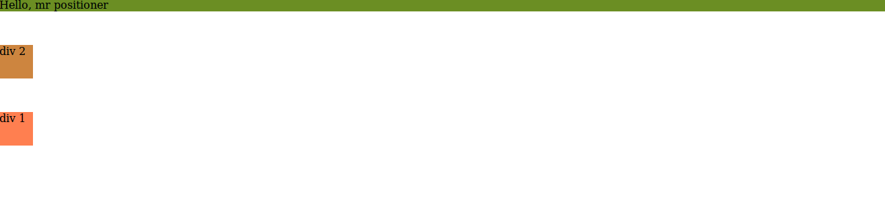
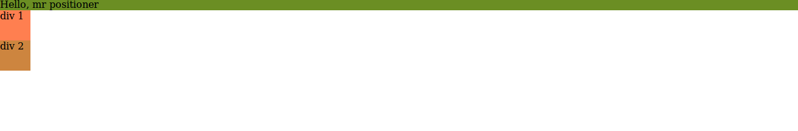
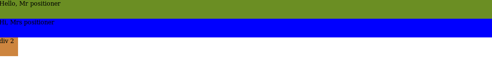

# FLEX BOX
# Display 
## Display Values are
1.  flex
2.  inline-flex 
3.  inline 
4.  block
5.  contents
6.  grid
7.  inline-block
8.  inline-grid
9.  inline-table 
10. list-item 
11. run-in
12. table 
13. table-caption
14. table-column-group 
15. table-header-group 
16. table-footer-group
17. table-row-group
18. table-cell
19. table-column
20. table-row 
21. none 
22. initial 
23. inherit 

## Display: flex
This makes the content of your page stack close to ano another ia a horizontal format. 
1. the container covers the whole horizontal area of page

## Display: inline-flex
This equally displays the elements stack horizontally,but its difference fron display: flex, is that
1. it doest not take over the entire row, it takes the exact wdth, whethear, small or big*

## Display: inline
Y=This display the element as an inline element just like  span tag.
1. Any height and width will be ignored*

## Display: block
This display the element as a block element like the p tag.
1. Each element takes up the whole width on a seperate line

## Display: contents
It makes the containing container disappear
1. Every property that has to do with the container disappears. Only the children stays*
2. The color, border, margin, padding of the containing element disappears*
3. But the color and font does show up*

## Display: grid
This makes the children of a contaning element take up the full width and height of the container equally
1. if the cotainer  has a width of 
```css
   width: 300px;
   height: 500px
```
while the children, a width of 
```css
   width: 100px; (in  total) and 
   height: 400px
```
the chlden will share the remaining 200px in width and 100px in height among them selves equally

## Display: inline-block
This considers the margin of the containing element and also the padding.
1. It wraps the element and removes spaces or extra width of the element execpt there is an implicit width
2. It treats the element as an inline element and also a block element. 
3. Extra remaining space is occupied by other elements.

## Display: inline-grid
This is similar to grid. The difference is
1. its inline. It takes the width of the content. Extra with is letf for other elements to.
eg. if width of the content is 200px, the container will justcover it up leaving other space around it for other elements

## Display: inline-table
1. This ignores the width of the children.
2. If a width is given to the container, it takes the width only if it covers he children, Else, it ignores the width and wraps the children.
3. The children arranges itself to be contained in the container, taking the next line if the width is not enough for another child

## Display: run-in
Displays an element as either block or inline, depending on context 

## Display: list-item
Let the element behave like a li element
It goes wee with 
```css
list-style-position:
```
## Display: table 
The element behaves like a table.
1. It waps the element releasing excess space

## Display: table-caption 
1. The key part is that they are rendered as normal block boxes and hence each of them is displayed one below the other (as in, in their own row).


# flex-direction
## Flex-direction values
1. row
2. row-reverse
3. column
4. column-reverse
5. initial
6. inherit

## Flex-direction: row
This is the default setting. It makes the elements to stack fromleft to right

## flex-direction: roww-reverse
This is somehow similar to row. The major difference is 
1. It arranges itself from right to left
2. It starts from right side of the page to the left side

## flex-diection: column
This arranges the element fro top to bottom

## flex-direction: column-resverse
This is like column. The major difference is
1. It arranges itselffrom bottom to top
2. The aarangement starts from the bottom page to the top

## flex-direction: initial
Sets this property to its default value

## flex-direction: inherit
Inherits this property from its parent element.


# flex wrap
## flex-wrap values
1. nowrap
2. wrap
3. wrap-reverse
4. inital
5. inhrit
# flex-wrap: wrap;
This ensures that the items maintain there width. 
1. They all take up the designated width, moving over to next line if there is no more space left.
2. They all share the available  height equally

## flex-wrap: wrap-reverse;
This is similar to wrap. the difference is that it move from bottom to top, still maintainin its from left to fight position. 
1. They all take up the designated width, moving over to next line if there is no more space left.
2. They all share the available  height equally

## flex-wrap: nowrap
This is the default value. it simply tells the items not to wrap

## flew-wrap: initial
This sets the item to a default value.

## flew-wrap: inherit
This says inherits the parent property


# order
Its sets the order in which an item is layed in a grid or flex container
1. The item must be displayed flex or grid

## order: value
The values could be negative and positive integers
1. negative nomber stay atop
2. Positive number says below
3. Zero and novalue remains in position
order = 
(at the beginning)... -2, -1, 1, 0(default), 1, 2 , ...(at the end)
4. Order changes the arrangement of a text if being copied


# justify-content
1. justify-content: space-around;
2. justify-content: space-between;
3. justify-content: space-evenly;
4. justify-content: initial;
5. justify-content: inherit;
6. justify-content: flex-end;
7. justify-content: flex-start;
7. justify-content: center;
## justify-content: space-round;
The items are evenly distributed along main axis(vertical) with  spaces around them.

## justify-content: space-between;
The items are evenly distributed along main axis but fist item is on the start line while the last itemis on the end-line.

## justify-content: space-evenly;
The items are evenly distributed along main axis. From the first to last element.

## justify-content: initial
This sets the property to its default value

## justify-content: inherit
Inherits this property from its parent element.

## justify-content: flex-end
The items are parked towards the end of the container

## justify-content: flex-start
(default): items are packed toward the start line

## justify-content: center
 items are centered along the line


# align-items
 <li>Note</li>
 
 *  In Flexbox it controls the alignment of items on the Cross Axis(vertical direction)
 * In Grid Layout it controls the alignment of items on the Block Axis(horizontal direction) within their grid area.
 *  Align-item works better along side with display flex or grid

 Think of it as the justify-content version for the cross-axis (perpendicular to the main-axis).
CSS Syntax
1. stretch(default)
2. center
3. flex-start
3. flex-end
4. baseline
5. initial
6. inherit;
## align-item: stretch
This vertically streches the width of the content of the element to the entire width
its is the default value

## align-item: center
This centers the element along the vertical axis when using 
```css
display: flex
```
But along horizontal axis when using 
```css
display: grid
```

## align-item: flex-start
This aligns the content from the top of the page down verticaly

## align-item: flex-end
Unlike flex-start, it starts from the bottom and moves upwards

## align-item: baseline
This makes all the write up of the page have the same base margin. ie, the content will be positined at the same baseline  of the cotainer  

# align-content
The CSS align-content property sets how the browser distributes space between and around content items along the cross-axis(horizontal) of a flexbox container, and the main-axis of a grid container.
@!Always be used along side with flex-wrap: wrap!@
1. flex-start
2. flex-end:
3. center:
4. space-between: 
5. space-around:
6. stretch (default)

## flex-start: 
lines packed to the start othe container(horizontally)
## flex-end:
 lines packed to the end of thcontainer(horizontally)
## center:
 lines packed to the center of the container (horizontally)
## space-between:
 This evenly distributes the first line  at the start of the container while the last one is at the end
## space-around:
 This evenly distributes the elements with equal space around each line
## stretch (default):
 lines stretch to take up the remaining space


# *difference between justify-content, align-content and align-item*
* The align-items property of flex-box aligns the items inside a <h3 >*flex container(using display: flex)*</h3> along the *cross axis (vertical ||)* just like 

* justify-content does along the <h3>(*main axis(horizontal ==)*)</h3> . (For the default flex-direction: row the cross axis corresponds to vertical and the main axis corresponds to horizontal. With flex-direction: column those two are interchanged respectively).

* But align-content is for multi line flexible boxes. <h3>(*flex-wrap: wrap and wrap-reverse create a multi-line flex container*)</h3> It has no effect when items are in a single line (*flex-wrap: nowrap creates a single-line flex container*). It aligns the whole structure according to its value. The CSS align-content property sets how the browser distributes space between and around content items along the cross-axis(horizontal) of a flexbox container, and the main-axis of a grid container.

 <h3>(*To maintain the width of the elements and yet keep them at the say bottom, use fles-wrap: wrap and align-content: flex-end. To keep an element at the bottom without regarding its individual width, use flex-wrap: nowrap and align-items; flex-end*)</h3>

#  align-self
The align-self CSS property aligns (*flex items*) of the current flex line overriding the (*align-items*) value
Note
If any of the item's cross-axis margin is set to auto, then align-self is ignored. In Grid layout align-self aligns the item inside the grid area.
```css
.box5 {
    align-self: flex-end;/*will not  not take effect*/
    margin-top: auto;
    margin-bottom: auto;
  }
```

## flex
It determines at what proprotion should i scale my selve up or down whaen there is an extra space or not enough space
One could assign figures like 1 to the flex property
```css
  .box {
     flex: 1/*This simply tells the elements to take up the entire width of the page proportionally*/
   }
  .container {
      display: flex;
    }
  .box5 {
    flex: 4 /*The fourth box will take up 4 * the size of every other box size if there is extra space. Esle, will remain the samesize as the others*/
  }
```

## flex-grow
IT defines the ability for a flex item to grow if necessary. 
Syntax
```css
flex-grow: <number>
  .container {
      display: flex;
      flex-grow: 1
    }
    .box5 {
      flex-grow: 1
    }
    .box8 {
      flex-grow: 5
    }
```
From the code above, box 8 and box 5 will share the remaining space left.  While box5 grows at the rate of 1, box 8 grows at the rate of 5
NOTE: The space is not really  shared into 6 (5 + 1) while box5 takes 1 part, box8  takes up the other part. The boxes  simply grow. That is to say, box8 is not necessarily 5 time box5

## flex-shrink
This  helps determine how an element is shrinked or reduces  as the browser gets smaller
```css
flex-shrink: <number>
  .container {
      display: flex;
      flex-shrink: 1
    }
    .box5 {
      flex-shrink: 1
    }
    .box8 {
      flex-shrink: 5
    }
```
From the above code, when the page is reduced or shrinked, box8 reduces or shrinks faster and gets smaller than box5
NOTE: The higher the value the more it shrinks


# flex-basis
The flex-basis CSS property sets the initial main size of a flex item. It sets the size of the content box unless otherwise set with box-sizing.
Note: If the element is not a flexible item, the flex-basis property has no effect.

# flex shorthand
*Syntax flex: flex-grow flex shrink flex basis*

This is a shorthand property that sets flex-grow, flex-shrink, and flex-basis.

_________________________________________________________________________________________________
# POSITIONING
The position CSS property sets how an element is positioned in a document.
## Positioning values
1. relative
2. sticky
3. fixed
4. absolute
5. static (default)

 
 ## position: relative;
 The element is positioned according to the normal flow of the document.
 * it introduces the ability to use z-index on that element, which doesn't really work with statically  
* The top and bottom properties specify the vertical offset from its normal position; the left and right properties specify the horizontal offset.

read more here https://css-tricks.com/absolute-relative-fixed-positioining-how-do-they-differ/

 ```html
  <p>Hello, mr positioner</p>
  <div class="div1">div 1</div>
  <div class="div2">div 2</div>
 ```
 ```css
  p {
      background: olivedrab;
      margin: 0;
    }
    .div1 {
      height: 50px;
      width: 50px;
      background: coral;
      position: relative;
      top: 150px
    }
    .div2 {
      height: 50px;
      width: 50px;
      background: peru;
    }
 ```

But when 

```css
   position: relative; /*is commented out*/ 

 p {
      background: olivedrab;
      margin: 0;
    }
    .div1 {
      height: 50px;
      width: 50px;
      background: coral;
      /* position: relative; */
      top: 150px  /*this wil not take effect */
    }
    .div2 {
      height: 50px;
      width: 50px;
      background: peru;
    }
```
The result will be

 ### *From my own understanding, relative positioning allows the the page elements to stay in its normal position regarding the existence of the element's(with positin relative) defaut position, and also allows the element in qestion to to be repsoitioned from its default position using the top, left, right and bottom properties which will  not affect the the other elements*
 
 ## position: static;
 An element with *position: static;* is not positioned in any special way; it is always positioned according to the normal flow of the page:
 * Note: 
   Static positioned elements are not affected by the top, bottom, left, and right properties.

## position: fixed
An element with position: fixed; is positioned relative to the viewport.
<li>Note:</li> 

* The element is removed from the normal document flow,
* It always stays in the same place even if the page is scrolled 
* It can be repositioned with the top, bottom, right or left props
* no space is created for the element in the page layout

### Effect of top, bottom, left and right on it
Top, right, left and bottom affects the element in regards to its viewport.

let’s say an element has a top value of 20px, it will be positioned 20px from the top of the viewport
```css
    <p>Hello, Mr positioner</p>
    <p>Hi, Mrs positioner</p>
    <div class="div1">div 1</div>
    <div class="div2">div 2</div>
```
```css
  body {
      padding: 0;
      margin: 0;
    }
    p {
      background: olivedrab;
      height: 50px;
      margin: 0;
    }
    div {
      height: 50px;
      width: 50px;
      background: peru;
    }
    p:nth-child(2) {
      background: blue;
    }
    .div1 {
      background: hotpink;
      position: fixed;
      top: 20px
    }

```

   

## position: absolute;
* The element is removed from the normal document flow, 
* no space is created for the element in the page layout.
* Well, it is positioned based on its closest ancestor with a position other than static. 
* If there is not an ancestor that fits the criteria, it is positioned relative to the body element. 
<li>Note: body can be scrolled unlike viewport</li>

### Effect of top, bottom, left and right on it
When position is set to absolute or fixed, the top property specifies the distance between the element's top edge and the top edge of its containing block.

<!-- 
Position: fixed
https://learn.shayhowe.com/advanced-html-css/detailed-css-positioning/

https://codetheweb.blog/2017/11/21/css-position-property/

https://developer.mozilla.org/en-US/docs/Web/CSS/position

Node
https://medium.freecodecamp.org/understanding-the-core-of-nodejs-the-powerful-chrome-v8-engine-79e7eb8af964

https://v8.dev/

https://flaviocopes.com/v8/
 -->


# PREPROCESSOR
A preprocessor adds an additional step before our css code its self. It is usually having  a language on top css such scss or sas. 
## Reasons for writing scss instead of css
It has a powerful capability
1. Variability
2. Nexting
3. Mixings
4. Automatic Vendor Prefixing
5. More flexible
6. Has powerful frameworks and can equally make use of bootstrap right from your scss code

# *Differences between Sass and SCSS*
## SASS ______ Syntactically Awesome Stlte-Sheets
1. Its is the original language that came up with this extral capabilities on top of css to be able to write much moer reuseable code
2. It also the original syntaxing language
3. The syntax is shorter
4. Does not use semicolons or {}
5. you must use a new line for every line of code you make instead of semicolon ; (You can't write tow dierent lines in the same line)
6. Strict rules for whitespaces
7. =my-mixin
8. +my-mixin
9. @import foo 
10. @extend foo
EG
```css
.container 
  float: left
  width: 100%
p
  color: #333
```
## SCSS  ______ Sassy CSS
1. It was built with the purpose to make it closer to css language so that people using usig css can easily transition to scss withpout having to learn a new syntax. 
2. The css syntax is basically the subset of scss syntax
3. Ignore whitespaces
4. @mixin my-mixin
5. @include my-mixin
6. @import foo
7. @ extend foo
Eg
```css
.container {
  float: left;
  width: 100%;
  p {
    color: #333;
  }
}
```

## Partials
They are SCSS file that are not converted to css files, Therefore the preprocessors will not create any css files from them
1. The name must always start with underscore_ eg _variables.scss

## Importing Partials
Here is my package.json file.  *_"scss": "node-sass --watch  scss -o css"_* .This line of code watches any changes in your scss and css files. Whaenever your edit or make changes in either your partials or scss file which are both in your scss/ folder,  the effect will be authormatically take effect.
```json
{
  "name": "scss",
  "version": "1.0.0",
  "description": "",
  "main": "index.js",
  "scripts": {
    "test": "echo \"Error: no test specified\" && exit 1",
    "scss": "node-sass --watch  scss -o css"
  },
  "author": "Eze Bernardine May",
  "license": "ISC"
}
```
This here aremy variables inmy partials, and the name of my partial is _variables.scss
```js
$text-color: rgb(228, 86, 10);
$background-color: rgb(114, 118, 90);
$font-size: 81%;
```
This here is how to import your oartials into your main.scss code
```js
@import '_variables.scss';
```

# Mixins
This allows us to reuse our codes multiple time as we wish.
*Syntax*
```scss
@mixin first {
  background-color: $header-color;
  border-color: $header-color;
}
```
*How to use it*
```scss
h1 {
  color: $text-color;
  @include first;
    }
```
# mixin with arguements
Mixins can be used along side arguements. For instance
```scss
@mixin margin-padding-border($margin, $padding, $border) {
  margin: $margin;
  padding: $padding;
  border: $border;
}
```
 ($margin, $padding, $border) are the arguements  passed when ever this mixin (margin-padding-border) is called.
 And to use them, you have to make use of the @include keyword followed by the arguement parameters

```scss
  @include margin-padding-border(0, 0, 0);
  or
  @include width-height($width: 0, $height: 100%, $margin: 5%);
```
In this case, both will output the same result.

## Importance of mixin
1. It makes your code short and reuseable
2. Allows your code look clean and easy to read

## functions in sass
Sass has quite  some functions like 
1. 
```css
color: darken(red, 25%) //This makes the color to darken by 25%
```
2. 
```css
color: lighten(red, 25%) //This makes the color to lighter by 25%
```
